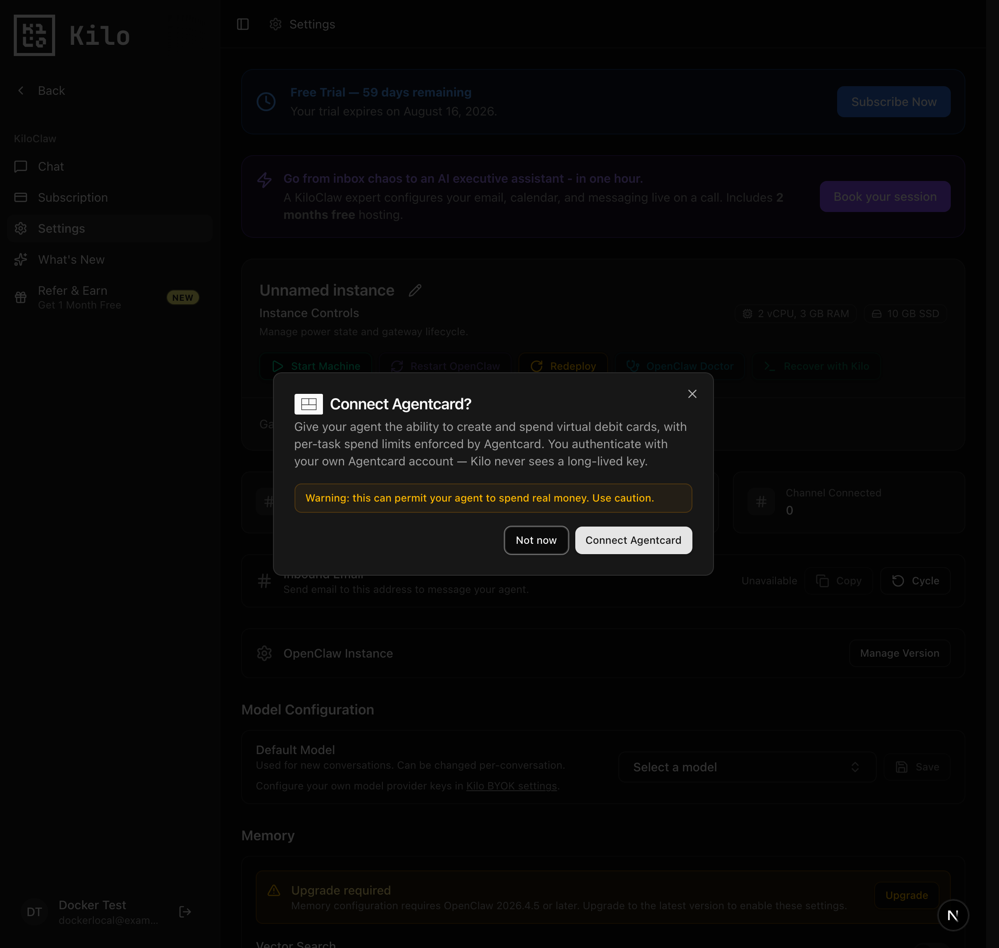
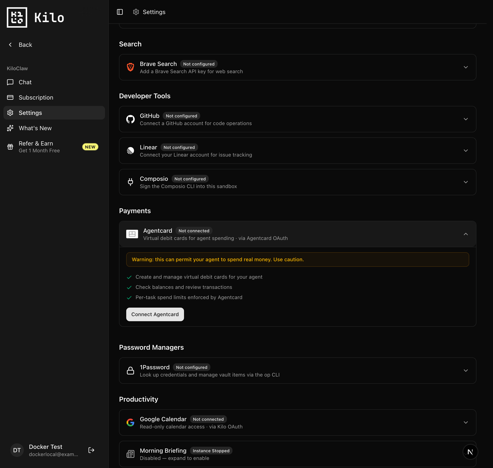
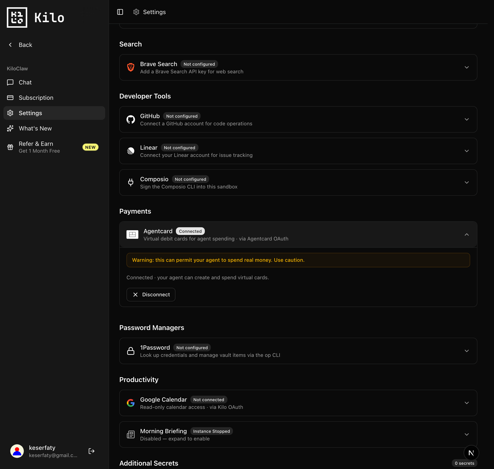

# AgentCard integration

A first-class **AgentCard** connection for KiloClaw: a one-click *Connect Agentcard*
OAuth 2.1 (PKCE) flow that replaces the old paste-a-token approach. Once connected,
the user's AgentCard access token is pushed to their agent's worker, the `agentcard`
MCP server is configured automatically, and the bundled `agentcard` skill lets the
agent act on requests like "create a $20 card."

## Screenshots

| First-run prompt | Not connected | Connected |
|---|---|---|
|  |  |  |

## How it works

```
Settings ▸ Connect Agentcard
  └─ GET  /api/integrations/agentcard/connect       → signed PKCE state, redirect to AgentCard /authorize
        └─ AgentCard sign-in (magic link) + consent
  └─ GET  /api/integrations/agentcard/callback      → verify state, exchange code → tokens (encrypted, stored)
        └─ push access token to the worker as AGENTCARD_API_KEY  (config-writer → `agentcard` MCP Bearer)
  └─ POST /api/integrations/agentcard/disconnect    → revoke grant, clear connection, drop worker secret
  cron  /api/cron/agentcard-token-refresh (10m)     → refresh near-expiry tokens, re-push to the worker
```

Key files:

| Path | Purpose |
|---|---|
| `apps/web/src/lib/integrations/agentcard/agentcard-service.ts` | OAuth 2.1 client (PKCE, dynamic registration, token exchange/refresh/revoke) |
| `apps/web/src/lib/integrations/agentcard/oauth-state.ts` | HMAC-signed PKCE state (binds the flow to the user; 10-min TTL) |
| `apps/web/src/lib/kiloclaw/agentcard-oauth-connections.ts` | Encrypted per-instance token store + refresh helpers |
| `apps/web/src/lib/kiloclaw/agentcard-token-refresh.ts` | Cron sweep that refreshes + re-pushes tokens |
| `apps/web/src/app/api/integrations/agentcard/{connect,callback,disconnect}/route.ts` | The three OAuth routes |
| `apps/web/src/app/(app)/claw/components/SettingsTab.tsx` | The "Agentcard" settings card |
| `services/kiloclaw/skills/agentcard/SKILL.md` | Agent skill describing the AgentCard MCP tools |
| `packages/db` migration `0159` | `kiloclaw_agentcard_oauth_connections` table |

## Environment variables

| Var | Required | Default | Notes |
|---|---|---|---|
| `AGENTCARD_MCP_BASE_URL` | no | `https://mcp.agentcard.sh` | AgentCard's OAuth 2.1 server. Override for sandbox/local. |
| `AGENTCARD_OAUTH_CLIENT_ID` | no | — | Pre-registered client id; if unset, the integration dynamically registers one. |
| `AGENT_ENV_VARS_PUBLIC_KEY` | for the worker push | — | RSA public key used to encrypt the token pushed to the worker (worker decrypts with `AGENT_ENV_VARS_PRIVATE_KEY`). Normally pulled from the project's Vercel env. |
| `BYOK_ENCRYPTION_KEY` | yes | — | Symmetric key the web app uses to encrypt tokens at rest. |

## Testing

### Production-shaped (full end-to-end)

Requires the normal KiloClaw stack — a running agent worker and the project Vercel
env (`vercel env pull`, which provides `AGENT_ENV_VARS_PUBLIC_KEY` and the worker's
private key). Connect from Settings; the token is pushed to the worker and the agent
can call AgentCard tools (`mcporter call agentcard.list_cards`, etc.).

### Local (no worker)

The OAuth flow itself — connect, magic link, consent, callback, token storage,
disconnect — is fully testable locally. The only piece that needs a real worker is
the secret hand-off, so card *usage* by the agent isn't exercised locally.

> Local sign-in and a worker-less instance rely on the dev conveniences on branch
> `chore/local-dev-kiloclaw-mock` (fake login + `KILOCLAW_DEV_MOCK` fake instance).
> Merge/cherry-pick that branch locally before testing.

1. **Infra + migrations**
   ```bash
   docker compose -f dev/docker-compose.yml up -d
   pnpm drizzle migrate
   ```
2. **Run AgentCard locally** (in the agent-cards repo): backend on `:3001`, then the
   MCP OAuth server pointed at it:
   ```bash
   AGENT_CARDS_API_URL=http://localhost:3001 MCP_BASE_URL=http://localhost:3012 PORT=3012 \
     pnpm --filter mcp dev:http
   ```
3. **Point Kilo at it** — in `apps/web/.env.development.local`:
   ```
   AGENTCARD_MCP_BASE_URL=http://localhost:3012
   ```
4. **Run the web app** (`pnpm dev:start` or `pnpm --filter web dev`) and sign in:
   ```
   http://localhost:3000/users/sign_in?fakeUser=you@admin.example.com&callbackPath=/claw/settings
   ```
5. **Settings ▸ Payments ▸ Connect Agentcard** → finish the magic-link + consent →
   you land back on Settings showing **Connected**. (On a worker-less fake instance
   the token push is skipped so the connection shows connected rather than
   `agentcard_connect_incomplete`.)

### Verifying the token actually works (simulating the worker)

The worker just sets a `Bearer` header on the `agentcard` MCP server. To prove the
token Kilo obtained authorizes against AgentCard without standing up a worker,
decrypt the stored access token (`kiloclaw_agentcard_oauth_connections.access_token_encrypted`,
`BYOK_ENCRYPTION_KEY`) and call the AgentCard MCP server directly:

```
POST http://localhost:3012/mcp
Authorization: Bearer <decrypted access token>
{ "jsonrpc": "2.0", "id": 1, "method": "tools/list" }
```

A successful `tools/list` (and a read-only `get_mode` / `list_cards` call) confirms
the full chain end-to-end except the Cloudflare worker hop.
