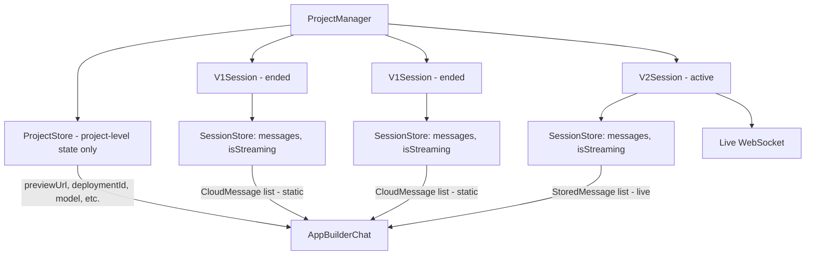
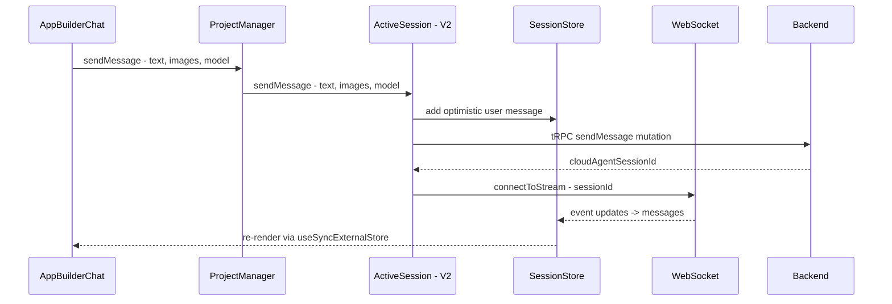
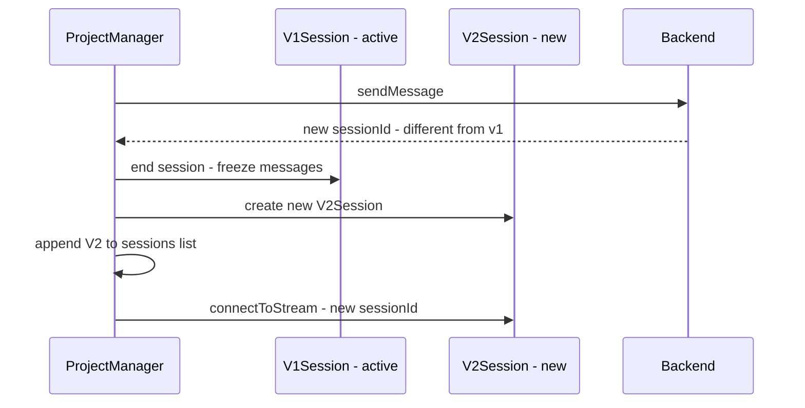
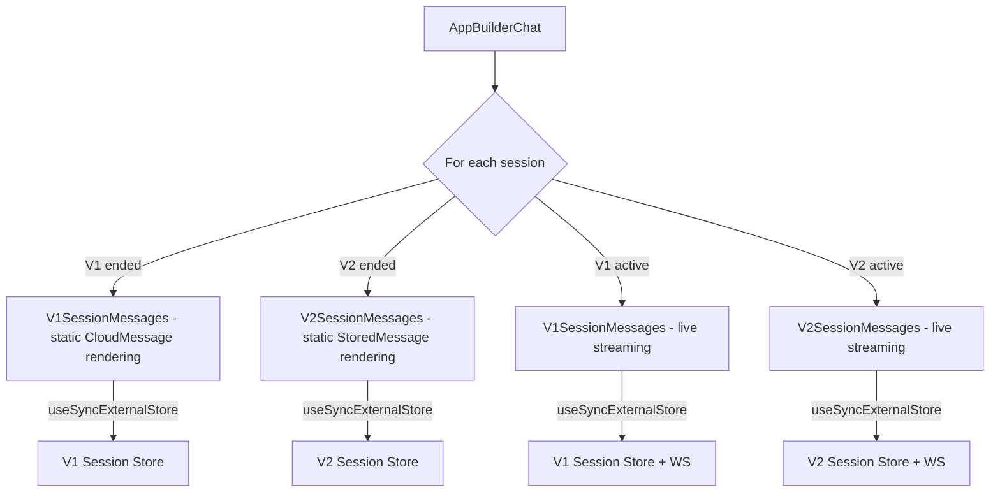

# App Builder: Session-Based Architecture Redesign

## Problem

The current implementation mixes v1 and v2 concerns into a single store and streaming coordinator:

- [`ProjectStore`](src/components/app-builder/project-manager/store.ts:56) has both `messages` (v1 CloudMessage[]) and `v2Messages` (v2 StoredMessage[]) plus `activeSessionWorkerVersion`
- [`streaming.ts`](src/components/app-builder/project-manager/streaming.ts:53) internally branches on worker version, managing both a v1 and v2 coordinator
- [`AppBuilderChat.tsx`](src/components/app-builder/AppBuilderChat.tsx:509) has separate rendering branches based on `activeSessionWorkerVersion`
- Sessions are just metadata (`ProjectSessionInfo[]`) in the store, not self-contained units

This makes the code hard to reason about: version checks leak everywhere, the store mixes concerns, and adding a new version would require touching every file.

## Desired Architecture

Each session is a **fully self-contained unit** with its own messages, store, streaming, and lifecycle. A project is an ordered list of sessions. The UI iterates through sessions to display the full conversation.



## Folder Structure

```
project-manager/
├── sessions/
│   ├── types.ts              # AppBuilderSession, V1Session, V2Session discriminated union
│   ├── v1/
│   │   ├── v1-session.ts     # createV1Session factory
│   │   ├── store.ts          # V1 session store - CloudMessage[]
│   │   ├── streaming.ts      # V1 streaming - wraps websocket-streaming.ts
│   │   ├── websocket-streaming.ts  # Low-level V1 WS - moved from project-manager/
│   │   └── messages.ts       # V1 message utils - moved from project-manager/
│   └── v2/
│       ├── v2-session.ts     # createV2Session factory
│       ├── store.ts          # V2 session store - StoredMessage[]
│       └── streaming.ts      # V2 streaming - wraps v2-websocket-streaming.ts, moved from project-manager/
├── store.ts                  # Project-level store - simplified, no messages
├── types.ts                  # Project-level types - simplified
├── preview-polling.ts        # Unchanged
├── deployments.ts            # Unchanged
├── logging.ts                # Unchanged
└── __tests__/                # Updated tests
```

Files removed from top-level `project-manager/`:

- `streaming.ts` — logic absorbed into `sessions/v1/streaming.ts` and `sessions/v2/streaming.ts`
- `websocket-streaming.ts` — moved to `sessions/v1/websocket-streaming.ts`
- `v2-websocket-streaming.ts` — moved to `sessions/v2/streaming.ts` (merged with its wrapper)
- `messages.ts` — moved to `sessions/v1/messages.ts`

## Key Design Decisions

### 1. Discriminated Union for Session Types

V1 and V2 have incompatible message types - `CloudMessage` vs `StoredMessage`. Rather than normalizing, each session type owns its message format and rendering:

```typescript
type V1SessionState = {
  messages: CloudMessage[];
  isStreaming: boolean;
};

type V2SessionState = {
  messages: StoredMessage[];
  isStreaming: boolean;
};

type V1Session = {
  type: 'v1';
  info: ProjectSessionInfo;
  subscribe: fn;
  getState: () => V1SessionState;
  sendMessage: fn;
  interrupt: fn;
  startInitialStreaming: fn;
  connectToExistingSession: fn;
  destroy: fn;
};

type V2Session = {
  type: 'v2';
  info: ProjectSessionInfo;
  subscribe: fn;
  getState: () => V2SessionState;
  sendMessage: fn;
  interrupt: fn;
  startInitialStreaming: fn;
  connectToExistingSession: fn;
  destroy: fn;
};

type AppBuilderSession = V1Session | V2Session;
```

### 2. Project Store Becomes Simpler

The project-level store holds only project-level state - no messages, no version tracking:

```typescript
type ProjectState = {
  isInterrupting: boolean;
  previewUrl: string | null;
  previewStatus: PreviewStatus;
  deploymentId: string | null;
  model: string;
  currentIframeUrl: string | null;
  gitRepoFullName: string | null;
};
```

### 3. isStreaming is Per-Session, Derived at Project Level

Only the active session can stream. The project-level `isStreaming` is derived by checking the active session's state, eliminating the need to synchronize this flag across stores.

### 4. Session Lifecycle

- **Ended sessions**: Hold their loaded messages statically. No WebSocket. Messages loaded once from backend.
- **Active session**: Has a live WebSocket connection. Messages update in real-time.
- **Upgrade**: When v1->v2 upgrade happens, the v1 session is ended (its messages frozen), a new v2 session is created and added to the list.

## Data Flow

### Sending a Message - Active V2 Session



### Auto-Upgrade v1 -> v2



### UI Rendering



## Session Factory API

### `createV1Session`

```typescript
// sessions/v1/v1-session.ts
function createV1Session(config: {
  info: ProjectSessionInfo;
  initialMessages: CloudMessage[];
  // Only needed for active sessions:
  projectId?: string;
  organizationId?: string | null;
  trpcClient?: AppTRPCClient;
  cloudAgentSessionId?: string | null;
  sessionPrepared?: boolean | null;
  onStreamComplete?: () => void;
}): V1Session;
```

### `createV2Session`

```typescript
// sessions/v2/v2-session.ts
function createV2Session(config: {
  info: ProjectSessionInfo;
  initialMessages: StoredMessage[];
  // Only needed for active sessions:
  projectId?: string;
  organizationId?: string | null;
  trpcClient?: AppTRPCClient;
  cloudAgentSessionId?: string | null;
  onStreamComplete?: () => void;
}): V2Session;
```

## Files Changed Summary

### New Files

| File                        | Purpose                                                        |
| --------------------------- | -------------------------------------------------------------- |
| `sessions/types.ts`         | `AppBuilderSession`, `V1Session`, `V2Session` type definitions |
| `sessions/v1/v1-session.ts` | Factory: creates a self-contained V1 session                   |
| `sessions/v1/store.ts`      | V1 session store with `CloudMessage[]`                         |
| `sessions/v1/streaming.ts`  | V1 streaming coordinator                                       |
| `sessions/v2/v2-session.ts` | Factory: creates a self-contained V2 session                   |
| `sessions/v2/store.ts`      | V2 session store with `StoredMessage[]`                        |
| `sessions/v2/streaming.ts`  | V2 streaming coordinator                                       |

### Moved Files

| From                        | To                                       |
| --------------------------- | ---------------------------------------- |
| `websocket-streaming.ts`    | `sessions/v1/websocket-streaming.ts`     |
| `v2-websocket-streaming.ts` | Absorbed into `sessions/v2/streaming.ts` |
| `messages.ts`               | `sessions/v1/messages.ts`                |

### Modified Files

| File                 | Changes                                                                                                                                                                        |
| -------------------- | ------------------------------------------------------------------------------------------------------------------------------------------------------------------------------ |
| `types.ts`           | Remove `v2Messages`, `activeSessionWorkerVersion`, `sessions`, `messages`, `isStreaming` from `ProjectState`. Remove `updateV2Messages`, `updateMessages` from `ProjectStore`. |
| `store.ts`           | Remove all message/session/v2 state. Simplified to project-level concerns only.                                                                                                |
| `ProjectManager.ts`  | Hold `sessions: AppBuilderSession[]`. Delegate `sendMessage`/`interrupt` to active session. Handle upgrade. Expose sessions for UI iteration.                                  |
| `AppBuilderChat.tsx` | Iterate through sessions. Render per-session components. Each subscribes to its own session store. Remove version branching.                                                   |

### Removed Files

| File           | Reason                                              |
| -------------- | --------------------------------------------------- |
| `streaming.ts` | Logic absorbed into session-level streaming modules |

### Unchanged Files

| File                 | Why                   |
| -------------------- | --------------------- |
| `preview-polling.ts` | Project-level concern |
| `deployments.ts`     | Project-level concern |
| `logging.ts`         | Shared utility        |

## Implementation Order

1. Create `sessions/types.ts` - define session discriminated union types
2. Create `sessions/v1/` - move `websocket-streaming.ts` and `messages.ts`, create `store.ts`, `streaming.ts`, `v1-session.ts`
3. Create `sessions/v2/` - create `store.ts`, `streaming.ts` (absorbing `v2-websocket-streaming.ts`), `v2-session.ts`
4. Simplify `store.ts` - remove session/message concerns
5. Simplify `types.ts` - remove session/message fields from ProjectState
6. Refactor `ProjectManager.ts` - manage session list, delegate to active session
7. Remove `streaming.ts` from top level
8. Refactor `AppBuilderChat.tsx` - iterate sessions, render per-session components
9. Update tests
