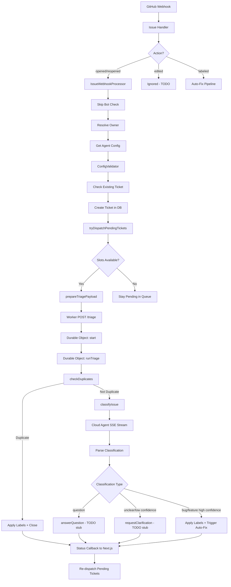

# Auto-Triage Feature — Comprehensive Test Plan

## 1. Overview

### Purpose

This document is the authoritative test plan for the auto-triage feature. It covers every component, code path, integration boundary, and known bug. It is designed to be directly implementable — each test case has a unique ID, concrete steps, and verifiable expected results.

### Scope

The auto-triage feature spans four layers:

| Layer                 | Location                        | Key Files                                                                                                                                                                 |
| --------------------- | ------------------------------- | ------------------------------------------------------------------------------------------------------------------------------------------------------------------------- |
| **Cloudflare Worker** | `cloudflare-auto-triage-infra/` | `index.ts`, `triage-orchestrator.ts`, `classification-parser.ts`, `sse-stream-processor.ts`, `prompt-builder.ts`, `github-labels-service.ts`, `cloud-agent-client.ts`     |
| **Next.js Backend**   | `src/`                          | Internal API routes (`triage-status`, `check-duplicates`, `classify-config`, `add-label`, `post-comment`), webhook handlers, dispatch system, tRPC routers, DB operations |
| **Frontend**          | `src/components/auto-triage/`   | `AutoTriageConfigForm.tsx`, `AutoTriageTicketsCard.tsx`                                                                                                                   |
| **External Services** | —                               | GitHub API, Milvus vector DB, Mistral embeddings, Cloud Agent (LLM)                                                                                                       |

### Current State

**Zero existing tests.** Every test case in this plan is net-new.

### Architecture Flow



---

## 2. Test Strategy

### Test Pyramid

| Type            | Purpose                                               | Mocking Strategy                                | Runner           |
| --------------- | ----------------------------------------------------- | ----------------------------------------------- | ---------------- |
| **Unit**        | Individual functions, parsers, validators, pure logic | Mock all external deps                          | Jest             |
| **Integration** | API routes, DB operations, multi-module flows         | Real DB, mock external APIs                     | Jest             |
| **E2E**         | Full webhook-to-action flows                          | Mock GitHub API + Cloud Agent, real DB + worker | Jest + miniflare |

### Priority Levels

| Priority | Meaning                     | Criteria                                                    |
| -------- | --------------------------- | ----------------------------------------------------------- |
| **P0**   | Must ship before production | Auth, data integrity, state machine correctness, known bugs |
| **P1**   | Critical for reliability    | Error handling, timeouts, concurrency, dispatch logic       |
| **P2**   | Important for correctness   | Edge cases, input validation, UI behavior                   |
| **P3**   | Nice to have                | Performance, logging, metrics                               |

### What to Mock vs. Test Real

| Component               | Strategy                                   |
| ----------------------- | ------------------------------------------ |
| Database (PostgreSQL)   | **Real** — use test DB with transactions   |
| GitHub API              | **Mock** — `fetch` interceptor             |
| Milvus vector DB        | **Mock** — mock `getMilvusClient()`        |
| Mistral embeddings      | **Mock** — mock `createEmbeddingService()` |
| Cloud Agent             | **Mock** — mock SSE stream responses       |
| Durable Object storage  | **Mock** — in-memory `ctx.storage`         |
| `fetch` in worker       | **Mock** — intercept all outbound calls    |
| Feature flags (PostHog) | **Mock** — control flag state              |

---

## 3. Test Categories

### 3.1 Webhook Processing Pipeline

#### 3.1.1 Issue Handler Router

| ID        | Description                                       | Preconditions     | Steps                                   | Expected Result                               | Priority | Type | File                                                                                          |
| --------- | ------------------------------------------------- | ----------------- | --------------------------------------- | --------------------------------------------- | -------- | ---- | --------------------------------------------------------------------------------------------- |
| AT-WH-001 | Routes `opened` action to auto-triage processor   | Valid integration | Send webhook with `action: 'opened'`    | `handleIssueAutoTriage()` called, returns 202 | P0       | Unit | [`issue-handler.ts`](src/lib/integrations/platforms/github/webhook-handlers/issue-handler.ts) |
| AT-WH-002 | Routes `reopened` action to auto-triage processor | Valid integration | Send webhook with `action: 'reopened'`  | `handleIssueAutoTriage()` called, returns 202 | P0       | Unit | [`issue-handler.ts`](src/lib/integrations/platforms/github/webhook-handlers/issue-handler.ts) |
| AT-WH-003 | Ignores `edited` action with 200                  | Valid integration | Send webhook with `action: 'edited'`    | Returns 200 with `'Event received'`           | P1       | Unit | [`issue-handler.ts`](src/lib/integrations/platforms/github/webhook-handlers/issue-handler.ts) |
| AT-WH-004 | Routes `labeled` action to auto-fix pipeline      | Valid integration | Send webhook with `action: 'labeled'`   | `handleIssueLabeled()` called                 | P1       | Unit | [`issue-handler.ts`](src/lib/integrations/platforms/github/webhook-handlers/issue-handler.ts) |
| AT-WH-005 | Ignores `unlabeled` action                        | Valid integration | Send webhook with `action: 'unlabeled'` | Returns 200                                   | P2       | Unit | [`issue-handler.ts`](src/lib/integrations/platforms/github/webhook-handlers/issue-handler.ts) |
| AT-WH-006 | Rejects invalid payload with 400                  | Valid integration | Send malformed JSON                     | Returns 400 with validation errors            | P0       | Unit | [`issue-handler.ts`](src/lib/integrations/platforms/github/webhook-handlers/issue-handler.ts) |
| AT-WH-007 | Handles unknown action gracefully                 | Valid integration | Send webhook with `action: 'closed'`    | Returns 200                                   | P2       | Unit | [`issue-handler.ts`](src/lib/integrations/platforms/github/webhook-handlers/issue-handler.ts) |

#### 3.1.2 Issue Webhook Processor

| ID        | Description                                                    | Preconditions                              | Steps                           | Expected Result                                                  | Priority | Type        | File                                                                                               |
| --------- | -------------------------------------------------------------- | ------------------------------------------ | ------------------------------- | ---------------------------------------------------------------- | -------- | ----------- | -------------------------------------------------------------------------------------------------- |
| AT-WH-010 | Skips bot sender events                                        | `sender.type === 'Bot'`                    | Process webhook from bot sender | Returns 200 with `'Skipped bot event'`                           | P0       | Unit        | [`issue-webhook-processor.ts`](src/lib/auto-triage/application/webhook/issue-webhook-processor.ts) |
| AT-WH-011 | Skips when agent not enabled                                   | Agent config `is_enabled: false`           | Process webhook                 | Returns 200 with skip message                                    | P0       | Unit        | [`issue-webhook-processor.ts`](src/lib/auto-triage/application/webhook/issue-webhook-processor.ts) |
| AT-WH-012 | Skips when agent config missing                                | No agent config in DB                      | Process webhook                 | Returns 200 with skip message                                    | P1       | Unit        | [`issue-webhook-processor.ts`](src/lib/auto-triage/application/webhook/issue-webhook-processor.ts) |
| AT-WH-013 | Returns 500 when owner resolution fails                        | Integration missing both org and user IDs  | Process webhook                 | Returns 500 `'Integration missing user context'`                 | P0       | Unit        | [`issue-webhook-processor.ts`](src/lib/auto-triage/application/webhook/issue-webhook-processor.ts) |
| AT-WH-014 | Returns 200 when existing ticket found                         | Ticket already exists for repo+issue       | Process webhook for same issue  | Returns 200 with existing `ticketId`                             | P0       | Unit        | [`issue-webhook-processor.ts`](src/lib/auto-triage/application/webhook/issue-webhook-processor.ts) |
| AT-WH-015 | Creates ticket and dispatches on valid webhook                 | All preconditions met, no existing ticket  | Process valid webhook           | Ticket created in DB, dispatch triggered, returns 202            | P0       | Integration | [`issue-webhook-processor.ts`](src/lib/auto-triage/application/webhook/issue-webhook-processor.ts) |
| AT-WH-016 | Resolves org owner with bot user                               | Org integration with bot user configured   | Process webhook                 | Owner has `userId` from bot user                                 | P0       | Unit        | [`issue-webhook-processor.ts`](src/lib/auto-triage/application/webhook/issue-webhook-processor.ts) |
| AT-WH-017 | Falls back to integration creator when bot user missing        | Org integration, no bot user               | Process webhook                 | Owner has `userId` from `kilo_requester_user_id`                 | P1       | Unit        | [`issue-webhook-processor.ts`](src/lib/auto-triage/application/webhook/issue-webhook-processor.ts) |
| AT-WH-018 | Returns null owner when no userId available                    | Org integration, no bot user, no requester | Process webhook                 | Returns 500                                                      | P1       | Unit        | [`issue-webhook-processor.ts`](src/lib/auto-triage/application/webhook/issue-webhook-processor.ts) |
| AT-WH-019 | Resolves personal user owner                                   | User integration (no org)                  | Process webhook                 | Owner type is `'user'`, id from `owned_by_user_id`               | P0       | Unit        | [`issue-webhook-processor.ts`](src/lib/auto-triage/application/webhook/issue-webhook-processor.ts) |
| AT-WH-020 | Dispatch failure does not prevent ticket creation              | Dispatch throws error                      | Process webhook                 | Ticket created (pending), 202 returned, error captured by Sentry | P0       | Integration | [`issue-webhook-processor.ts`](src/lib/auto-triage/application/webhook/issue-webhook-processor.ts) |
| AT-WH-021 | Extracts issue labels from string array format                 | Labels as `['bug', 'help']`                | Process webhook                 | `issueLabels` stored as `['bug', 'help']`                        | P2       | Unit        | [`issue-webhook-processor.ts`](src/lib/auto-triage/application/webhook/issue-webhook-processor.ts) |
| AT-WH-022 | Extracts issue labels from object array format                 | Labels as `[{name: 'bug'}]`                | Process webhook                 | `issueLabels` stored as `['bug']`                                | P2       | Unit        | [`issue-webhook-processor.ts`](src/lib/auto-triage/application/webhook/issue-webhook-processor.ts) |
| AT-WH-023 | Handles null/undefined labels                                  | `issue.labels` is undefined                | Process webhook                 | `issueLabels` stored as `[]`                                     | P2       | Unit        | [`issue-webhook-processor.ts`](src/lib/auto-triage/application/webhook/issue-webhook-processor.ts) |
| AT-WH-024 | Concurrent webhooks for same issue — only first creates ticket | Two webhooks arrive simultaneously         | Process both concurrently       | First creates ticket, second returns existing ticket (200)       | P0       | Integration | [`issue-webhook-processor.ts`](src/lib/auto-triage/application/webhook/issue-webhook-processor.ts) |

### 3.2 Config Validation

| ID        | Description                                                    | Preconditions                                                                  | Steps                                        | Expected Result                                                    | Priority | Type | File                                                                                 |
| --------- | -------------------------------------------------------------- | ------------------------------------------------------------------------------ | -------------------------------------------- | ------------------------------------------------------------------ | -------- | ---- | ------------------------------------------------------------------------------------ |
| AT-CV-001 | Rejects when `enabled_for_issues` is false                     | Config with `enabled_for_issues: false`                                        | Call `validate()`                            | `{ isValid: false, reason: 'Auto triage not enabled for issues' }` | P0       | Unit | [`config-validator.ts`](src/lib/auto-triage/application/webhook/config-validator.ts) |
| AT-CV-002 | Passes when `repository_selection_mode` is `'all'`             | Config with `repository_selection_mode: 'all'`                                 | Call `validate()` with any repo              | `{ isValid: true }`                                                | P0       | Unit | [`config-validator.ts`](src/lib/auto-triage/application/webhook/config-validator.ts) |
| AT-CV-003 | Passes when repo ID is in selected list                        | Config with `selected_repository_ids: [123]`, repo ID 123                      | Call `validate()`                            | `{ isValid: true }`                                                | P0       | Unit | [`config-validator.ts`](src/lib/auto-triage/application/webhook/config-validator.ts) |
| AT-CV-004 | Rejects when repo ID not in selected list                      | Config with `selected_repository_ids: [123]`, repo ID 456                      | Call `validate()`                            | `{ isValid: false, reason: 'Repository not configured...' }`       | P0       | Unit | [`config-validator.ts`](src/lib/auto-triage/application/webhook/config-validator.ts) |
| AT-CV-005 | Rejects when issue has a skip label                            | Config with `skip_labels: ['wontfix']`, issue has `'wontfix'`                  | Call `validate()`                            | `{ isValid: false, reason: 'Issue has skip label' }`               | P0       | Unit | [`config-validator.ts`](src/lib/auto-triage/application/webhook/config-validator.ts) |
| AT-CV-006 | Passes when issue has no skip labels                           | Config with `skip_labels: ['wontfix']`, issue has `['bug']`                    | Call `validate()`                            | `{ isValid: true }`                                                | P1       | Unit | [`config-validator.ts`](src/lib/auto-triage/application/webhook/config-validator.ts) |
| AT-CV-007 | Passes when no skip labels configured                          | Config with `skip_labels: []`                                                  | Call `validate()`                            | `{ isValid: true }`                                                | P2       | Unit | [`config-validator.ts`](src/lib/auto-triage/application/webhook/config-validator.ts) |
| AT-CV-008 | Passes when all required labels present                        | Config with `required_labels: ['triage-me']`, issue has `['triage-me', 'bug']` | Call `validate()`                            | `{ isValid: true }`                                                | P0       | Unit | [`config-validator.ts`](src/lib/auto-triage/application/webhook/config-validator.ts) |
| AT-CV-009 | Rejects when required labels missing                           | Config with `required_labels: ['triage-me']`, issue has `['bug']`              | Call `validate()`                            | `{ isValid: false, reason: 'Issue missing required labels' }`      | P0       | Unit | [`config-validator.ts`](src/lib/auto-triage/application/webhook/config-validator.ts) |
| AT-CV-010 | Passes when no required labels configured                      | Config with `required_labels: []`                                              | Call `validate()`                            | `{ isValid: true }`                                                | P2       | Unit | [`config-validator.ts`](src/lib/auto-triage/application/webhook/config-validator.ts) |
| AT-CV-011 | Handles labels as string array                                 | Issue labels: `['bug', 'help']`                                                | Call `validate()` with skip_labels `['bug']` | `{ isValid: false }` — skip label matched                          | P1       | Unit | [`config-validator.ts`](src/lib/auto-triage/application/webhook/config-validator.ts) |
| AT-CV-012 | Handles labels as object array                                 | Issue labels: `[{name: 'bug'}]`                                                | Call `validate()` with skip_labels `['bug']` | `{ isValid: false }` — skip label matched                          | P1       | Unit | [`config-validator.ts`](src/lib/auto-triage/application/webhook/config-validator.ts) |
| AT-CV-013 | Handles empty `selected_repository_ids` with `'selected'` mode | Config: `repository_selection_mode: 'selected'`, `selected_repository_ids: []` | Call `validate()`                            | `{ isValid: false }` — no repos allowed                            | P1       | Unit | [`config-validator.ts`](src/lib/auto-triage/application/webhook/config-validator.ts) |
| AT-CV-014 | Multiple required labels — all must be present                 | Config: `required_labels: ['a', 'b']`, issue has `['a']`                       | Call `validate()`                            | `{ isValid: false }` — missing `'b'`                               | P1       | Unit | [`config-validator.ts`](src/lib/auto-triage/application/webhook/config-validator.ts) |
| AT-CV-015 | Skip label check is ANY match (not ALL)                        | Config: `skip_labels: ['a', 'b']`, issue has `['a']`                           | Call `validate()`                            | `{ isValid: false }` — has skip label `'a'`                        | P1       | Unit | [`config-validator.ts`](src/lib/auto-triage/application/webhook/config-validator.ts) |

### 3.3 Dispatch System

| ID        | Description                                             | Preconditions                               | Steps                              | Expected Result                                                           | Priority | Type        | File                                                                                      |
| --------- | ------------------------------------------------------- | ------------------------------------------- | ---------------------------------- | ------------------------------------------------------------------------- | -------- | ----------- | ----------------------------------------------------------------------------------------- |
| AT-DS-001 | Returns early when no pending tickets                   | No pending tickets in DB                    | Call `tryDispatchPendingTickets()` | Returns `{ dispatched: 0, pending: 0, activeCount: 0 }`                   | P0       | Integration | [`dispatch-pending-tickets.ts`](src/lib/auto-triage/dispatch/dispatch-pending-tickets.ts) |
| AT-DS-002 | Dispatches single pending ticket when slots available   | 1 pending ticket, 0 analyzing               | Call `tryDispatchPendingTickets()` | Ticket status → `'analyzing'`, worker called, returns `{ dispatched: 1 }` | P0       | Integration | [`dispatch-pending-tickets.ts`](src/lib/auto-triage/dispatch/dispatch-pending-tickets.ts) |
| AT-DS-003 | Respects max concurrent limit (10)                      | 10 analyzing tickets, 1 pending             | Call `tryDispatchPendingTickets()` | Returns `{ dispatched: 0, pending: 1, activeCount: 10 }`                  | P0       | Integration | [`dispatch-pending-tickets.ts`](src/lib/auto-triage/dispatch/dispatch-pending-tickets.ts) |
| AT-DS-004 | Dispatches FIFO order by `created_at`                   | 3 pending tickets with different timestamps | Call `tryDispatchPendingTickets()` | Oldest ticket dispatched first                                            | P0       | Integration | [`dispatch-pending-tickets.ts`](src/lib/auto-triage/dispatch/dispatch-pending-tickets.ts) |
| AT-DS-005 | Dispatches multiple tickets up to available slots       | 5 pending, 7 analyzing (3 slots)            | Call `tryDispatchPendingTickets()` | 3 tickets dispatched, 2 remain pending                                    | P0       | Integration | [`dispatch-pending-tickets.ts`](src/lib/auto-triage/dispatch/dispatch-pending-tickets.ts) |
| AT-DS-006 | Individual ticket dispatch failure doesn't block others | 3 pending, first dispatch fails             | Call `tryDispatchPendingTickets()` | 2 dispatched, 1 failed, error captured                                    | P0       | Integration | [`dispatch-pending-tickets.ts`](src/lib/auto-triage/dispatch/dispatch-pending-tickets.ts) |
| AT-DS-007 | Handles org owner correctly                             | Org owner with pending tickets              | Call `tryDispatchPendingTickets()` | Queries by `owned_by_organization_id`                                     | P1       | Integration | [`dispatch-pending-tickets.ts`](src/lib/auto-triage/dispatch/dispatch-pending-tickets.ts) |
| AT-DS-008 | Handles user owner correctly                            | User owner with pending tickets             | Call `tryDispatchPendingTickets()` | Queries by `owned_by_user_id`                                             | P1       | Integration | [`dispatch-pending-tickets.ts`](src/lib/auto-triage/dispatch/dispatch-pending-tickets.ts) |
| AT-DS-009 | Throws when agent config not found during dispatch      | Pending ticket, no agent config             | Call `tryDispatchPendingTickets()` | Error captured, ticket not dispatched                                     | P1       | Integration | [`dispatch-pending-tickets.ts`](src/lib/auto-triage/dispatch/dispatch-pending-tickets.ts) |
| AT-DS-010 | Top-level error returns safe default                    | DB query throws                             | Call `tryDispatchPendingTickets()` | Returns `{ dispatched: 0, pending: 0, activeCount: 0 }`, error captured   | P1       | Unit        | [`dispatch-pending-tickets.ts`](src/lib/auto-triage/dispatch/dispatch-pending-tickets.ts) |

### 3.4 Internal API Routes

#### 3.4.1 POST /api/internal/triage/check-duplicates

| ID        | Description                                                            | Preconditions                         | Steps        | Expected Result                                                  | Priority | Type        | File                                                                                 |
| --------- | ---------------------------------------------------------------------- | ------------------------------------- | ------------ | ---------------------------------------------------------------- | -------- | ----------- | ------------------------------------------------------------------------------------ |
| AT-CD-001 | Rejects missing `X-Internal-Secret` header                             | No header                             | POST request | 401 Unauthorized                                                 | P0       | Integration | [`check-duplicates/route.ts`](src/app/api/internal/triage/check-duplicates/route.ts) |
| AT-CD-002 | Rejects wrong `X-Internal-Secret`                                      | Wrong secret value                    | POST request | 401 Unauthorized                                                 | P0       | Integration | [`check-duplicates/route.ts`](src/app/api/internal/triage/check-duplicates/route.ts) |
| AT-CD-003 | Rejects missing `ticketId`                                             | Valid secret, empty body              | POST request | 400 with error message                                           | P0       | Integration | [`check-duplicates/route.ts`](src/app/api/internal/triage/check-duplicates/route.ts) |
| AT-CD-004 | Returns 404 for non-existent ticket                                    | Valid secret, fake ticketId           | POST request | 404 `'Ticket not found'`                                         | P1       | Integration | [`check-duplicates/route.ts`](src/app/api/internal/triage/check-duplicates/route.ts) |
| AT-CD-005 | Generates and stores embedding on first call                           | Ticket exists, no `qdrant_point_id`   | POST request | Embedding generated, stored in Milvus, `qdrant_point_id` updated | P0       | Integration | [`check-duplicates/route.ts`](src/app/api/internal/triage/check-duplicates/route.ts) |
| AT-CD-006 | Skips embedding generation when already stored                         | Ticket has `qdrant_point_id`          | POST request | No embedding call, proceeds to search                            | P1       | Integration | [`check-duplicates/route.ts`](src/app/api/internal/triage/check-duplicates/route.ts) |
| AT-CD-007 | Returns `isDuplicate: false` when no similar tickets                   | No similar tickets in Milvus          | POST request | `{ isDuplicate: false, similarTickets: [] }`                     | P0       | Integration | [`check-duplicates/route.ts`](src/app/api/internal/triage/check-duplicates/route.ts) |
| AT-CD-008 | Returns `isDuplicate: true` when similarity >= 0.9                     | Similar ticket with score 0.95        | POST request | `{ isDuplicate: true }`, ticket status updated to `'actioned'`   | P0       | Integration | [`check-duplicates/route.ts`](src/app/api/internal/triage/check-duplicates/route.ts) |
| AT-CD-009 | Returns `isDuplicate: false` when similarity between threshold and 0.9 | Similar ticket with score 0.85        | POST request | `{ isDuplicate: false, similarTickets: [score: 0.85] }`          | P0       | Integration | [`check-duplicates/route.ts`](src/app/api/internal/triage/check-duplicates/route.ts) |
| AT-CD-010 | Excludes self-match from results                                       | Ticket's own embedding in Milvus      | POST request | Self not in `similarTickets`                                     | P1       | Integration | [`check-duplicates/route.ts`](src/app/api/internal/triage/check-duplicates/route.ts) |
| AT-CD-011 | Preprocesses issue text — removes code blocks                          | Issue body with ` ```code``` ` blocks | POST request | Embedding generated from cleaned text                            | P2       | Unit        | [`check-duplicates/route.ts`](src/app/api/internal/triage/check-duplicates/route.ts) |
| AT-CD-012 | Preprocesses issue text — truncates to 32000 chars                     | Issue body > 32000 chars              | POST request | Text truncated before embedding                                  | P2       | Unit        | [`check-duplicates/route.ts`](src/app/api/internal/triage/check-duplicates/route.ts) |
| AT-CD-013 | Handles null issue body                                                | Issue body is null                    | POST request | Preprocessed as `"title\n\n"`                                    | P2       | Unit        | [`check-duplicates/route.ts`](src/app/api/internal/triage/check-duplicates/route.ts) |
| AT-CD-014 | Escapes filter values for Milvus                                       | Org ID with special chars             | POST request | Filter expression properly escaped                               | P1       | Unit        | [`check-duplicates/route.ts`](src/app/api/internal/triage/check-duplicates/route.ts) |
| AT-CD-015 | Uses `organizationId` OR `userId` for org scoping                      | Ticket owned by org                   | POST request | Milvus filter uses `owned_by_organization_id`                    | P1       | Integration | [`check-duplicates/route.ts`](src/app/api/internal/triage/check-duplicates/route.ts) |
| AT-CD-016 | Handles Milvus connection failure                                      | Milvus client throws                  | POST request | 500 error, Sentry capture                                        | P1       | Integration | [`check-duplicates/route.ts`](src/app/api/internal/triage/check-duplicates/route.ts) |
| AT-CD-017 | Handles Mistral embedding failure                                      | Embedding service throws              | POST request | 500 error, Sentry capture                                        | P1       | Integration | [`check-duplicates/route.ts`](src/app/api/internal/triage/check-duplicates/route.ts) |
| AT-CD-018 | Respects custom threshold parameter                                    | `threshold: 0.95` in request          | POST request | Only tickets with score >= 0.95 returned                         | P2       | Integration | [`check-duplicates/route.ts`](src/app/api/internal/triage/check-duplicates/route.ts) |
| AT-CD-019 | Respects custom limit parameter                                        | `limit: 2` in request                 | POST request | At most 2 similar tickets returned                               | P2       | Integration | [`check-duplicates/route.ts`](src/app/api/internal/triage/check-duplicates/route.ts) |

#### 3.4.2 POST /api/internal/triage/classify-config

| ID        | Description                                              | Preconditions                            | Steps        | Expected Result                                                    | Priority | Type        | File                                                                                  |
| --------- | -------------------------------------------------------- | ---------------------------------------- | ------------ | ------------------------------------------------------------------ | -------- | ----------- | ------------------------------------------------------------------------------------- |
| AT-CC-001 | Rejects unauthorized request                             | No/wrong `X-Internal-Secret`             | POST request | 401                                                                | P0       | Integration | [`classify-config/route.ts`](src/app/api/internal/triage/classify-config/route.ts)    |
| AT-CC-002 | Rejects missing `ticketId`                               | Valid secret, empty body                 | POST request | 400                                                                | P0       | Integration | [`classify-config/route.ts`](src/app/api/internal/triage/classify-config/route.ts)    |
| AT-CC-003 | Returns 404 for non-existent ticket                      | Valid secret, fake ticketId              | POST request | 404                                                                | P1       | Integration | [`classify-config/route.ts`](src/app/api/internal/triage/classify-config/route.ts)    |
| AT-CC-004 | Returns GitHub token when integration exists             | Ticket with valid integration            | POST request | Response includes `githubToken`                                    | P0       | Integration | [`classify-config/route.ts`](src/app/api/internal/triage/classify-config/route.ts)    |
| AT-CC-005 | Continues without token when integration missing         | Ticket without `platform_integration_id` | POST request | Response has no `githubToken`, config still returned               | P1       | Integration | [`classify-config/route.ts`](src/app/api/internal/triage/classify-config/route.ts)    |
| AT-CC-006 | Continues without token when token generation fails      | Integration exists but token gen throws  | POST request | Response has no `githubToken`, error captured by Sentry            | P1       | Integration | [`classify-config/route.ts`](src/app/api/internal/triage/classify-config/route.ts)    |
| AT-CC-007 | Returns 404 when agent config not found                  | Ticket exists, no agent config           | POST request | 404 `'Agent config not found'`                                     | P1       | Integration | [`classify-config/route.ts`](src/app/api/internal/triage/classify-config/route.ts)    |
| AT-CC-008 | Returns model_slug and custom_instructions from config   | Agent config with custom values          | POST request | Response contains correct `model_slug` and `custom_instructions`   | P0       | Integration | [`classify-config/route.ts`](src/app/api/internal/triage/classify-config/route.ts)    |
| AT-CC-009 | Builds org owner with `userId` set to org ID (known bug) | Org-owned ticket                         | POST request | Owner `userId` equals `owned_by_organization_id` (not actual user) | P0       | Integration | [`classify-config/route.ts`](src/app/api/internal/triage/classify-config/route.ts:95) |

#### 3.4.3 POST /api/internal/triage/add-label

| ID        | Description                                                               | Preconditions                                              | Steps        | Expected Result                                                   | Priority | Type        | File                                                                       |
| --------- | ------------------------------------------------------------------------- | ---------------------------------------------------------- | ------------ | ----------------------------------------------------------------- | -------- | ----------- | -------------------------------------------------------------------------- |
| AT-AL-001 | Rejects unauthorized request                                              | No/wrong `X-Internal-Secret`                               | POST request | 401                                                               | P0       | Integration | [`add-label/route.ts`](src/app/api/internal/triage/add-label/route.ts)     |
| AT-AL-002 | Rejects missing `ticketId`                                                | Valid secret, no ticketId                                  | POST request | 400                                                               | P0       | Integration | [`add-label/route.ts`](src/app/api/internal/triage/add-label/route.ts)     |
| AT-AL-003 | Rejects empty labels array                                                | Valid secret, `labels: []`                                 | POST request | 400                                                               | P0       | Integration | [`add-label/route.ts`](src/app/api/internal/triage/add-label/route.ts)     |
| AT-AL-004 | Returns 404 for non-existent ticket                                       | Fake ticketId                                              | POST request | 404                                                               | P1       | Integration | [`add-label/route.ts`](src/app/api/internal/triage/add-label/route.ts)     |
| AT-AL-005 | Returns 400 when no platform integration                                  | Ticket without `platform_integration_id`                   | POST request | 400 `'No platform integration found'`                             | P1       | Integration | [`add-label/route.ts`](src/app/api/internal/triage/add-label/route.ts)     |
| AT-AL-006 | Returns 400 when no installation ID                                       | Integration without `platform_installation_id`             | POST request | 400 `'No platform installation found'`                            | P1       | Integration | [`add-label/route.ts`](src/app/api/internal/triage/add-label/route.ts)     |
| AT-AL-007 | Adds multiple labels sequentially                                         | 3 labels to add                                            | POST request | All 3 labels added via GitHub API, each in separate call          | P0       | Integration | [`add-label/route.ts`](src/app/api/internal/triage/add-label/route.ts)     |
| AT-AL-008 | Updates ticket status to `'actioned'` with `'comment_posted'` (known bug) | Valid request                                              | POST request | `actionTaken` set to `'comment_posted'` instead of correct action | P0       | Integration | [`add-label/route.ts`](src/app/api/internal/triage/add-label/route.ts:109) |
| AT-AL-009 | Handles GitHub API failure for one label                                  | Second of 3 labels fails                                   | POST request | Error thrown, Sentry capture, 500 returned                        | P1       | Integration | [`add-label/route.ts`](src/app/api/internal/triage/add-label/route.ts)     |
| AT-AL-010 | Passes classification data to status update                               | Request includes classification, confidence, intentSummary | POST request | All fields passed to `updateTriageTicketStatus()`                 | P1       | Integration | [`add-label/route.ts`](src/app/api/internal/triage/add-label/route.ts)     |

#### 3.4.4 POST /api/internal/triage/post-comment

| ID        | Description                          | Preconditions                 | Steps        | Expected Result                                             | Priority | Type        | File                                                                         |
| --------- | ------------------------------------ | ----------------------------- | ------------ | ----------------------------------------------------------- | -------- | ----------- | ---------------------------------------------------------------------------- |
| AT-PC-001 | Rejects unauthorized request         | No/wrong `X-Internal-Secret`  | POST request | 401                                                         | P0       | Integration | [`post-comment/route.ts`](src/app/api/internal/triage/post-comment/route.ts) |
| AT-PC-002 | Rejects missing `ticketId`           | Valid secret, no ticketId     | POST request | 400                                                         | P0       | Integration | [`post-comment/route.ts`](src/app/api/internal/triage/post-comment/route.ts) |
| AT-PC-003 | Rejects empty `body`                 | Valid secret, `body: ''`      | POST request | 400 (Zod validation: `min(1)`)                              | P0       | Integration | [`post-comment/route.ts`](src/app/api/internal/triage/post-comment/route.ts) |
| AT-PC-004 | Returns 404 for non-existent ticket  | Fake ticketId                 | POST request | 404                                                         | P1       | Integration | [`post-comment/route.ts`](src/app/api/internal/triage/post-comment/route.ts) |
| AT-PC-005 | Posts comment to GitHub successfully | Valid ticket with integration | POST request | GitHub API called with correct repo/issue/body, returns 200 | P0       | Integration | [`post-comment/route.ts`](src/app/api/internal/triage/post-comment/route.ts) |
| AT-PC-006 | Handles GitHub API failure           | GitHub returns 403            | POST request | 500 error, Sentry capture                                   | P1       | Integration | [`post-comment/route.ts`](src/app/api/internal/triage/post-comment/route.ts) |
| AT-PC-007 | Uses Zod schema validation           | Various invalid payloads      | POST request | Consistent 400 responses for invalid data                   | P1       | Unit        | [`post-comment/route.ts`](src/app/api/internal/triage/post-comment/route.ts) |

#### 3.4.5 POST /api/internal/triage-status/:ticketId

| ID        | Description                                                     | Preconditions                                      | Steps                                        | Expected Result                                                     | Priority | Type        | File                                                                                          |
| --------- | --------------------------------------------------------------- | -------------------------------------------------- | -------------------------------------------- | ------------------------------------------------------------------- | -------- | ----------- | --------------------------------------------------------------------------------------------- |
| AT-TS-001 | Rejects unauthorized request                                    | No/wrong `X-Internal-Secret`                       | POST request                                 | 401                                                                 | P0       | Integration | [`triage-status/[ticketId]/route.ts`](src/app/api/internal/triage-status/[ticketId]/route.ts) |
| AT-TS-002 | Rejects missing `status` field                                  | Valid secret, no status in body                    | POST request                                 | 400                                                                 | P0       | Integration | [`triage-status/[ticketId]/route.ts`](src/app/api/internal/triage-status/[ticketId]/route.ts) |
| AT-TS-003 | Returns 404 for non-existent ticket                             | Fake ticketId in URL                               | POST request                                 | 404                                                                 | P1       | Integration | [`triage-status/[ticketId]/route.ts`](src/app/api/internal/triage-status/[ticketId]/route.ts) |
| AT-TS-004 | Skips update when ticket already in terminal state (`actioned`) | Ticket status is `'actioned'`                      | POST with `status: 'failed'`                 | Returns 200 with `'Ticket already in terminal state'`, no DB update | P0       | Integration | [`triage-status/[ticketId]/route.ts`](src/app/api/internal/triage-status/[ticketId]/route.ts) |
| AT-TS-005 | Skips update when ticket already in terminal state (`failed`)   | Ticket status is `'failed'`                        | POST with `status: 'actioned'`               | Returns 200 with `'Ticket already in terminal state'`, no DB update | P0       | Integration | [`triage-status/[ticketId]/route.ts`](src/app/api/internal/triage-status/[ticketId]/route.ts) |
| AT-TS-006 | Updates `pending` → `analyzing`                                 | Ticket in `'pending'`                              | POST with `status: 'analyzing'`              | Status updated, `startedAt` set                                     | P0       | Integration | [`triage-status/[ticketId]/route.ts`](src/app/api/internal/triage-status/[ticketId]/route.ts) |
| AT-TS-007 | Updates `analyzing` → `actioned`                                | Ticket in `'analyzing'`                            | POST with `status: 'actioned'`               | Status updated, `completedAt` set, dispatch triggered               | P0       | Integration | [`triage-status/[ticketId]/route.ts`](src/app/api/internal/triage-status/[ticketId]/route.ts) |
| AT-TS-008 | Updates `analyzing` → `failed`                                  | Ticket in `'analyzing'`                            | POST with `status: 'failed'`, `errorMessage` | Status updated, `completedAt` set, dispatch triggered               | P0       | Integration | [`triage-status/[ticketId]/route.ts`](src/app/api/internal/triage-status/[ticketId]/route.ts) |
| AT-TS-009 | Triggers re-dispatch on terminal state for org owner            | Org ticket reaches `'actioned'`                    | POST with `status: 'actioned'`               | `tryDispatchPendingTickets()` called with org owner                 | P0       | Integration | [`triage-status/[ticketId]/route.ts`](src/app/api/internal/triage-status/[ticketId]/route.ts) |
| AT-TS-010 | Triggers re-dispatch on terminal state for user owner           | User ticket reaches `'actioned'`                   | POST with `status: 'actioned'`               | `tryDispatchPendingTickets()` called with user owner                | P0       | Integration | [`triage-status/[ticketId]/route.ts`](src/app/api/internal/triage-status/[ticketId]/route.ts) |
| AT-TS-011 | Does NOT trigger dispatch for non-terminal states               | Ticket in `'pending'`                              | POST with `status: 'analyzing'`              | No dispatch triggered                                               | P1       | Integration | [`triage-status/[ticketId]/route.ts`](src/app/api/internal/triage-status/[ticketId]/route.ts) |
| AT-TS-012 | Skips dispatch when bot user missing for org                    | Org ticket, no bot user                            | POST with `status: 'actioned'`               | Error logged, Sentry message captured, no dispatch                  | P0       | Integration | [`triage-status/[ticketId]/route.ts`](src/app/api/internal/triage-status/[ticketId]/route.ts) |
| AT-TS-013 | Dispatch failure does not fail the status update                | Dispatch throws                                    | POST with `status: 'actioned'`               | Status update succeeds, dispatch error captured                     | P1       | Integration | [`triage-status/[ticketId]/route.ts`](src/app/api/internal/triage-status/[ticketId]/route.ts) |
| AT-TS-014 | Passes all update fields to DB                                  | Full payload with classification, confidence, etc. | POST request                                 | All fields persisted in DB                                          | P1       | Integration | [`triage-status/[ticketId]/route.ts`](src/app/api/internal/triage-status/[ticketId]/route.ts) |

### 3.5 Cloudflare Worker Entry Point

| ID        | Description                                          | Preconditions               | Steps                                | Expected Result                                                                              | Priority | Type | File                                                    |
| --------- | ---------------------------------------------------- | --------------------------- | ------------------------------------ | -------------------------------------------------------------------------------------------- | -------- | ---- | ------------------------------------------------------- |
| AT-WK-001 | Returns 401 when `BACKEND_AUTH_TOKEN` is empty       | `BACKEND_AUTH_TOKEN = ''`   | Any request                          | 401 `{ error: 'Unauthorized' }`                                                              | P0       | Unit | [`index.ts`](cloudflare-auto-triage-infra/src/index.ts) |
| AT-WK-002 | Returns 401 when `BACKEND_AUTH_TOKEN` is whitespace  | `BACKEND_AUTH_TOKEN = '  '` | Any request                          | 401 `{ error: 'Unauthorized' }`                                                              | P0       | Unit | [`index.ts`](cloudflare-auto-triage-infra/src/index.ts) |
| AT-WK-003 | Returns 401 when no Bearer token provided            | Valid `BACKEND_AUTH_TOKEN`  | Request without Authorization header | 401                                                                                          | P0       | Unit | [`index.ts`](cloudflare-auto-triage-infra/src/index.ts) |
| AT-WK-004 | Returns 401 when Bearer token is wrong               | Valid `BACKEND_AUTH_TOKEN`  | Request with wrong token             | 401                                                                                          | P0       | Unit | [`index.ts`](cloudflare-auto-triage-infra/src/index.ts) |
| AT-WK-005 | POST /triage returns 400 for invalid JSON            | Valid auth                  | POST with non-JSON body              | 400 `'Invalid JSON body'`                                                                    | P0       | Unit | [`index.ts`](cloudflare-auto-triage-infra/src/index.ts) |
| AT-WK-006 | POST /triage returns 400 for missing required fields | Valid auth                  | POST with `{}`                       | 400 with missing fields error                                                                | P0       | Unit | [`index.ts`](cloudflare-auto-triage-infra/src/index.ts) |
| AT-WK-007 | POST /triage returns 400 when `ticketId` missing     | Valid auth                  | POST without `ticketId`              | 400                                                                                          | P0       | Unit | [`index.ts`](cloudflare-auto-triage-infra/src/index.ts) |
| AT-WK-008 | POST /triage returns 400 when `authToken` missing    | Valid auth                  | POST without `authToken`             | 400                                                                                          | P0       | Unit | [`index.ts`](cloudflare-auto-triage-infra/src/index.ts) |
| AT-WK-009 | POST /triage returns 400 when `sessionInput` missing | Valid auth                  | POST without `sessionInput`          | 400                                                                                          | P0       | Unit | [`index.ts`](cloudflare-auto-triage-infra/src/index.ts) |
| AT-WK-010 | POST /triage returns 400 when `owner` missing        | Valid auth                  | POST without `owner`                 | 400                                                                                          | P0       | Unit | [`index.ts`](cloudflare-auto-triage-infra/src/index.ts) |
| AT-WK-011 | POST /triage creates DO and returns 202              | Valid auth, valid payload   | POST /triage                         | DO `start()` called, `runTriage()` via `waitUntil`, returns 202 with `ticketId` and `status` | P0       | Unit | [`index.ts`](cloudflare-auto-triage-infra/src/index.ts) |
| AT-WK-012 | POST /triage uses ticketId as DO name                | Valid payload               | POST /triage                         | `idFromName()` called with `ticketId`                                                        | P1       | Unit | [`index.ts`](cloudflare-auto-triage-infra/src/index.ts) |
| AT-WK-013 | GET /tickets/:ticketId/events returns events         | DO has events               | GET request                          | Returns `{ events: [...] }`                                                                  | P1       | Unit | [`index.ts`](cloudflare-auto-triage-infra/src/index.ts) |
| AT-WK-014 | GET /health returns ok                               | —                           | GET /health                          | `{ status: 'ok', service: 'auto-triage-worker' }`                                            | P2       | Unit | [`index.ts`](cloudflare-auto-triage-infra/src/index.ts) |
| AT-WK-015 | Unknown route returns 404                            | —                           | GET /unknown                         | 404 `{ error: 'Not found' }`                                                                 | P2       | Unit | [`index.ts`](cloudflare-auto-triage-infra/src/index.ts) |
| AT-WK-016 | Global error handler returns 500                     | DO `start()` throws         | POST /triage                         | 500 with error message                                                                       | P1       | Unit | [`index.ts`](cloudflare-auto-triage-infra/src/index.ts) |
| AT-WK-017 | `runTriage()` failure in `waitUntil` is caught       | `runTriage()` throws        | POST /triage                         | 202 returned (fire-and-forget), error logged                                                 | P0       | Unit | [`index.ts`](cloudflare-auto-triage-infra/src/index.ts) |

### 3.6 Durable Object Orchestrator

#### 3.6.1 State Machine

| ID        | Description                                       | Preconditions                 | Steps              | Expected Result                                            | Priority | Type | File                                                                                |
| --------- | ------------------------------------------------- | ----------------------------- | ------------------ | ---------------------------------------------------------- | -------- | ---- | ----------------------------------------------------------------------------------- |
| AT-DO-001 | `start()` initializes state as `'pending'`        | Fresh DO                      | Call `start()`     | State saved with `status: 'pending'`, `updatedAt` set      | P0       | Unit | [`triage-orchestrator.ts`](cloudflare-auto-triage-infra/src/triage-orchestrator.ts) |
| AT-DO-002 | `runTriage()` transitions `pending` → `analyzing` | State is `'pending'`          | Call `runTriage()` | Status callback sent with `'analyzing'`, `startedAt` set   | P0       | Unit | [`triage-orchestrator.ts`](cloudflare-auto-triage-infra/src/triage-orchestrator.ts) |
| AT-DO-003 | `runTriage()` skips if not `'pending'`            | State is `'analyzing'`        | Call `runTriage()` | Returns immediately, no processing                         | P0       | Unit | [`triage-orchestrator.ts`](cloudflare-auto-triage-infra/src/triage-orchestrator.ts) |
| AT-DO-004 | `runTriage()` skips if `'actioned'`               | State is `'actioned'`         | Call `runTriage()` | Returns immediately                                        | P0       | Unit | [`triage-orchestrator.ts`](cloudflare-auto-triage-infra/src/triage-orchestrator.ts) |
| AT-DO-005 | `runTriage()` skips if `'failed'`                 | State is `'failed'`           | Call `runTriage()` | Returns immediately                                        | P0       | Unit | [`triage-orchestrator.ts`](cloudflare-auto-triage-infra/src/triage-orchestrator.ts) |
| AT-DO-006 | Error during triage sets status to `'failed'`     | `checkDuplicates()` throws    | Call `runTriage()` | Status → `'failed'`, `errorMessage` set, `completedAt` set | P0       | Unit | [`triage-orchestrator.ts`](cloudflare-auto-triage-infra/src/triage-orchestrator.ts) |
| AT-DO-007 | `loadState()` throws when no state stored         | Fresh DO, no `start()` called | Call `runTriage()` | Throws `'State not found'`                                 | P1       | Unit | [`triage-orchestrator.ts`](cloudflare-auto-triage-infra/src/triage-orchestrator.ts) |

#### 3.6.2 Duplicate Detection Flow

| ID        | Description                                               | Preconditions                                   | Steps         | Expected Result                                                                                                                   | Priority | Type | File                                                                                |
| --------- | --------------------------------------------------------- | ----------------------------------------------- | ------------- | --------------------------------------------------------------------------------------------------------------------------------- | -------- | ---- | ----------------------------------------------------------------------------------- |
| AT-DO-010 | Calls check-duplicates API with correct headers           | State initialized                               | `runTriage()` | Fetch to `/api/internal/triage/check-duplicates` with `X-Internal-Secret`                                                         | P0       | Unit | [`triage-orchestrator.ts`](cloudflare-auto-triage-infra/src/triage-orchestrator.ts) |
| AT-DO-011 | Handles duplicate found — applies labels and closes       | `checkDuplicates()` returns `isDuplicate: true` | `runTriage()` | Labels `['kilo-triaged', 'kilo-duplicate']` applied, comment posted, status → `'actioned'` with `actionTaken: 'closed_duplicate'` | P0       | Unit | [`triage-orchestrator.ts`](cloudflare-auto-triage-infra/src/triage-orchestrator.ts) |
| AT-DO-012 | Duplicate comment includes issue URL and similarity score | Duplicate with `similarTickets[0]`              | `runTriage()` | Comment contains GitHub issue URL, title, issue number, similarity percentage                                                     | P1       | Unit | [`triage-orchestrator.ts`](cloudflare-auto-triage-infra/src/triage-orchestrator.ts) |
| AT-DO-013 | Duplicate with no `similarTickets` skips comment          | `isDuplicate: true` but empty `similarTickets`  | `runTriage()` | No comment posted, status still → `'actioned'`                                                                                    | P1       | Unit | [`triage-orchestrator.ts`](cloudflare-auto-triage-infra/src/triage-orchestrator.ts) |
| AT-DO-014 | Throws when check-duplicates API returns non-OK           | API returns 500                                 | `runTriage()` | Error thrown with status text, status → `'failed'`                                                                                | P0       | Unit | [`triage-orchestrator.ts`](cloudflare-auto-triage-infra/src/triage-orchestrator.ts) |

#### 3.6.3 Classification Flow

| ID        | Description                                                     | Preconditions                     | Steps                              | Expected Result                                                              | Priority | Type | File                                                                                |
| --------- | --------------------------------------------------------------- | --------------------------------- | ---------------------------------- | ---------------------------------------------------------------------------- | -------- | ---- | ----------------------------------------------------------------------------------- |
| AT-DO-020 | Fetches config from classify-config API                         | Not duplicate                     | `classifyIssue()`                  | Fetch to `/api/internal/triage/classify-config` with correct ticketId        | P0       | Unit | [`triage-orchestrator.ts`](cloudflare-auto-triage-infra/src/triage-orchestrator.ts) |
| AT-DO-021 | Throws when classify-config returns non-OK                      | API returns 404                   | `classifyIssue()`                  | Error thrown with status text and body                                       | P0       | Unit | [`triage-orchestrator.ts`](cloudflare-auto-triage-infra/src/triage-orchestrator.ts) |
| AT-DO-022 | Uses default labels when no GitHub token                        | `githubToken` is undefined        | `classifyIssue()`                  | `DEFAULT_LABELS` used for prompt                                             | P1       | Unit | [`triage-orchestrator.ts`](cloudflare-auto-triage-infra/src/triage-orchestrator.ts) |
| AT-DO-023 | Fetches repo labels when GitHub token available                 | `githubToken` present             | `classifyIssue()`                  | `fetchRepoLabels()` called                                                   | P1       | Unit | [`triage-orchestrator.ts`](cloudflare-auto-triage-infra/src/triage-orchestrator.ts) |
| AT-DO-024 | Builds prompt with issue context and labels                     | Config and labels available       | `classifyIssue()`                  | `buildClassificationPrompt()` called with correct args                       | P1       | Unit | [`triage-orchestrator.ts`](cloudflare-auto-triage-infra/src/triage-orchestrator.ts) |
| AT-DO-025 | Initiates Cloud Agent session with correct params               | Prompt built                      | `classifyIssue()`                  | `CloudAgentClient.initiateSession()` called with mode `'ask'`, correct model | P0       | Unit | [`triage-orchestrator.ts`](cloudflare-auto-triage-infra/src/triage-orchestrator.ts) |
| AT-DO-026 | Classification timeout fires at configured time                 | `maxClassificationTimeMinutes: 2` | `classifyIssue()` with slow stream | Error `'Classification timeout'` after 2 minutes                             | P0       | Unit | [`triage-orchestrator.ts`](cloudflare-auto-triage-infra/src/triage-orchestrator.ts) |
| AT-DO-027 | Classification timeout uses default (5 min) when not configured | No `maxClassificationTimeMinutes` | `classifyIssue()`                  | Timeout set to 5 _ 60 _ 1000 ms                                              | P1       | Unit | [`triage-orchestrator.ts`](cloudflare-auto-triage-infra/src/triage-orchestrator.ts) |

#### 3.6.4 Action Routing

| ID        | Description                                                                    | Preconditions                                                 | Steps                              | Expected Result                                                                                        | Priority | Type | File                                                                                |
| --------- | ------------------------------------------------------------------------------ | ------------------------------------------------------------- | ---------------------------------- | ------------------------------------------------------------------------------------------------------ | -------- | ---- | ----------------------------------------------------------------------------------- |
| AT-DO-030 | Question classification → `answerQuestion()`                                   | Classification: `'question'`                                  | `runTriage()`                      | Labels `['kilo-triaged', ...selectedLabels]` applied, `answerQuestion()` called, status → `'actioned'` | P0       | Unit | [`triage-orchestrator.ts`](cloudflare-auto-triage-infra/src/triage-orchestrator.ts) |
| AT-DO-031 | Unclear classification → `requestClarification()`                              | Classification: `'unclear'`                                   | `runTriage()`                      | Labels applied, `requestClarification()` called, status → `'actioned'`                                 | P0       | Unit | [`triage-orchestrator.ts`](cloudflare-auto-triage-infra/src/triage-orchestrator.ts) |
| AT-DO-032 | High confidence bug → auto-fix labels                                          | Classification: `'bug'`, confidence >= `autoFixThreshold`     | `runTriage()`                      | Labels include `'kilo-auto-fix'`, status → `'actioned'` with classification data                       | P0       | Unit | [`triage-orchestrator.ts`](cloudflare-auto-triage-infra/src/triage-orchestrator.ts) |
| AT-DO-033 | High confidence feature → auto-fix labels                                      | Classification: `'feature'`, confidence >= `autoFixThreshold` | `runTriage()`                      | Labels include `'kilo-auto-fix'`                                                                       | P0       | Unit | [`triage-orchestrator.ts`](cloudflare-auto-triage-infra/src/triage-orchestrator.ts) |
| AT-DO-034 | Low confidence → `requestClarification()`                                      | Classification: `'bug'`, confidence < `autoFixThreshold`      | `runTriage()`                      | Labels applied (no `'kilo-auto-fix'`), `requestClarification()` called                                 | P0       | Unit | [`triage-orchestrator.ts`](cloudflare-auto-triage-infra/src/triage-orchestrator.ts) |
| AT-DO-035 | `answerQuestion()` is a stub — sets `actionTaken: 'comment_posted'`            | —                                                             | Call `answerQuestion()`            | Status updated with `actionTaken: 'comment_posted'`, no actual comment posted                          | P1       | Unit | [`triage-orchestrator.ts`](cloudflare-auto-triage-infra/src/triage-orchestrator.ts) |
| AT-DO-036 | `requestClarification()` is a stub — sets `actionTaken: 'needs_clarification'` | —                                                             | Call `requestClarification()`      | Status updated with `actionTaken: 'needs_clarification'`, no actual comment posted                     | P1       | Unit | [`triage-orchestrator.ts`](cloudflare-auto-triage-infra/src/triage-orchestrator.ts) |
| AT-DO-037 | `selectedLabels` from classification are included in applied labels            | Classification has `selectedLabels: ['enhancement']`          | `runTriage()`                      | Applied labels include `'kilo-triaged'` and `'enhancement'`                                            | P1       | Unit | [`triage-orchestrator.ts`](cloudflare-auto-triage-infra/src/triage-orchestrator.ts) |
| AT-DO-038 | Duplicate labels are deduplicated for auto-fix path                            | `selectedLabels` includes `'kilo-triaged'`                    | `runTriage()` with high confidence | Labels array has no duplicates (uses `Set`)                                                            | P2       | Unit | [`triage-orchestrator.ts`](cloudflare-auto-triage-infra/src/triage-orchestrator.ts) |

#### 3.6.5 Status Updates

| ID        | Description                                                | Preconditions           | Steps                            | Expected Result                                   | Priority | Type | File                                                                                |
| --------- | ---------------------------------------------------------- | ----------------------- | -------------------------------- | ------------------------------------------------- | -------- | ---- | ----------------------------------------------------------------------------------- |
| AT-DO-040 | `updateStatus()` saves to DO storage                       | —                       | Call `updateStatus('analyzing')` | `ctx.storage.put('state', ...)` called            | P0       | Unit | [`triage-orchestrator.ts`](cloudflare-auto-triage-infra/src/triage-orchestrator.ts) |
| AT-DO-041 | `updateStatus()` sends callback to Next.js                 | —                       | Call `updateStatus('actioned')`  | Fetch to `/api/internal/triage-status/{ticketId}` | P0       | Unit | [`triage-orchestrator.ts`](cloudflare-auto-triage-infra/src/triage-orchestrator.ts) |
| AT-DO-042 | `startedAt` set only on first `'analyzing'` transition     | Already has `startedAt` | Call `updateStatus('analyzing')` | `startedAt` not overwritten                       | P1       | Unit | [`triage-orchestrator.ts`](cloudflare-auto-triage-infra/src/triage-orchestrator.ts) |
| AT-DO-043 | `completedAt` set on `'actioned'`                          | —                       | Call `updateStatus('actioned')`  | `completedAt` set to current time                 | P1       | Unit | [`triage-orchestrator.ts`](cloudflare-auto-triage-infra/src/triage-orchestrator.ts) |
| AT-DO-044 | `completedAt` set on `'failed'`                            | —                       | Call `updateStatus('failed')`    | `completedAt` set to current time                 | P1       | Unit | [`triage-orchestrator.ts`](cloudflare-auto-triage-infra/src/triage-orchestrator.ts) |
| AT-DO-045 | `postComment()` is best-effort — does not throw on failure | Comment API returns 500 | Call `postComment()`             | Error logged, no exception thrown                 | P1       | Unit | [`triage-orchestrator.ts`](cloudflare-auto-triage-infra/src/triage-orchestrator.ts) |

### 3.7 Classification Parser

| ID        | Description                                                 | Preconditions                                           | Steps                        | Expected Result                                     | Priority | Type | File                                                                                            |
| --------- | ----------------------------------------------------------- | ------------------------------------------------------- | ---------------------------- | --------------------------------------------------- | -------- | ---- | ----------------------------------------------------------------------------------------------- |
| AT-CP-001 | Parses valid JSON from code block                           | Text with ` ```json {...} ``` `                         | Call `parseClassification()` | Returns valid `ClassificationResult`                | P0       | Unit | [`classification-parser.ts`](cloudflare-auto-triage-infra/src/parsers/classification-parser.ts) |
| AT-CP-002 | Parses valid JSON from code block without `json` tag        | Text with ` ``` {...} ``` `                             | Call `parseClassification()` | Returns valid `ClassificationResult`                | P1       | Unit | [`classification-parser.ts`](cloudflare-auto-triage-infra/src/parsers/classification-parser.ts) |
| AT-CP-003 | Parses raw JSON object from text                            | Text with `{...}` (no code block)                       | Call `parseClassification()` | Returns valid `ClassificationResult`                | P0       | Unit | [`classification-parser.ts`](cloudflare-auto-triage-infra/src/parsers/classification-parser.ts) |
| AT-CP-004 | Prefers last code block when multiple present               | Text with 2 code blocks, last is valid                  | Call `parseClassification()` | Returns result from last code block                 | P0       | Unit | [`classification-parser.ts`](cloudflare-auto-triage-infra/src/parsers/classification-parser.ts) |
| AT-CP-005 | Falls back to raw JSON when code blocks invalid             | Invalid code blocks, valid raw JSON                     | Call `parseClassification()` | Returns result from raw JSON                        | P1       | Unit | [`classification-parser.ts`](cloudflare-auto-triage-infra/src/parsers/classification-parser.ts) |
| AT-CP-006 | Prefers last raw JSON object when multiple present          | Text with 2 JSON objects, last is valid                 | Call `parseClassification()` | Returns result from last JSON object                | P1       | Unit | [`classification-parser.ts`](cloudflare-auto-triage-infra/src/parsers/classification-parser.ts) |
| AT-CP-007 | Throws when no valid classification found                   | Text with no JSON                                       | Call `parseClassification()` | Throws `'Failed to parse classification...'`        | P0       | Unit | [`classification-parser.ts`](cloudflare-auto-triage-infra/src/parsers/classification-parser.ts) |
| AT-CP-008 | Throws when JSON missing required fields                    | JSON without `classification`                           | Call `parseClassification()` | Throws                                              | P0       | Unit | [`classification-parser.ts`](cloudflare-auto-triage-infra/src/parsers/classification-parser.ts) |
| AT-CP-009 | Throws when JSON has invalid classification value           | `classification: 'spam'`                                | Call `parseClassification()` | Throws (Zod validation fails)                       | P1       | Unit | [`classification-parser.ts`](cloudflare-auto-triage-infra/src/parsers/classification-parser.ts) |
| AT-CP-010 | Throws when confidence out of range                         | `confidence: 1.5`                                       | Call `parseClassification()` | Throws (Zod validation fails)                       | P1       | Unit | [`classification-parser.ts`](cloudflare-auto-triage-infra/src/parsers/classification-parser.ts) |
| AT-CP-011 | Filters `selectedLabels` against available labels           | `selectedLabels: ['bug', 'fake']`, available: `['bug']` | Call `parseClassification()` | `selectedLabels: ['bug']` — `'fake'` removed        | P0       | Unit | [`classification-parser.ts`](cloudflare-auto-triage-infra/src/parsers/classification-parser.ts) |
| AT-CP-012 | Returns empty `selectedLabels` when none match              | `selectedLabels: ['fake']`, available: `['bug']`        | Call `parseClassification()` | `selectedLabels: []`                                | P1       | Unit | [`classification-parser.ts`](cloudflare-auto-triage-infra/src/parsers/classification-parser.ts) |
| AT-CP-013 | Handles missing `selectedLabels` field                      | JSON without `selectedLabels`                           | Call `parseClassification()` | `selectedLabels: []` (default from Zod)             | P1       | Unit | [`classification-parser.ts`](cloudflare-auto-triage-infra/src/parsers/classification-parser.ts) |
| AT-CP-014 | Handles non-array `selectedLabels`                          | `selectedLabels: 'bug'` (string)                        | Call `parseClassification()` | `selectedLabels: []` (filterValidLabels returns []) | P2       | Unit | [`classification-parser.ts`](cloudflare-auto-triage-infra/src/parsers/classification-parser.ts) |
| AT-CP-015 | Handles nested JSON objects correctly                       | JSON with nested `{...}` inside values                  | Call `parseClassification()` | Balanced brace matching extracts correct object     | P1       | Unit | [`classification-parser.ts`](cloudflare-auto-triage-infra/src/parsers/classification-parser.ts) |
| AT-CP-016 | `looksLikeClassification()` filters non-classification JSON | Text with `{"name": "test"}`                            | Call `parseClassification()` | Non-classification JSON ignored                     | P2       | Unit | [`classification-parser.ts`](cloudflare-auto-triage-infra/src/parsers/classification-parser.ts) |
| AT-CP-017 | Handles empty text                                          | `text = ''`                                             | Call `parseClassification()` | Throws                                              | P2       | Unit | [`classification-parser.ts`](cloudflare-auto-triage-infra/src/parsers/classification-parser.ts) |
| AT-CP-018 | Handles text with only prose (no JSON)                      | `text = 'This is a bug report about...'`                | Call `parseClassification()` | Throws                                              | P2       | Unit | [`classification-parser.ts`](cloudflare-auto-triage-infra/src/parsers/classification-parser.ts) |
| AT-CP-019 | Handles malformed JSON in code block                        | ` ```json { broken ``` `                                | Call `parseClassification()` | Falls through to next strategy                      | P2       | Unit | [`classification-parser.ts`](cloudflare-auto-triage-infra/src/parsers/classification-parser.ts) |

### 3.8 SSE Stream Processor

| ID         | Description                                     | Preconditions                                 | Steps                                         | Expected Result                                                         | Priority | Type | File                                                                                           |
| ---------- | ----------------------------------------------- | --------------------------------------------- | --------------------------------------------- | ----------------------------------------------------------------------- | -------- | ---- | ---------------------------------------------------------------------------------------------- |
| AT-SSE-001 | Processes `kilocode` event with `content` field | Stream with kilocode event                    | Call `processStream()`                        | `onTextContent` called with content string                              | P0       | Unit | [`sse-stream-processor.ts`](cloudflare-auto-triage-infra/src/services/sse-stream-processor.ts) |
| AT-SSE-002 | Processes `kilocode` event with `text` field    | Stream with `payload.type: 'text'`            | Call `processStream()`                        | `onTextContent` called with text string                                 | P0       | Unit | [`sse-stream-processor.ts`](cloudflare-auto-triage-infra/src/services/sse-stream-processor.ts) |
| AT-SSE-003 | Processes `output` event                        | Stream with output event                      | Call `processStream()`                        | `onTextContent` called with content                                     | P1       | Unit | [`sse-stream-processor.ts`](cloudflare-auto-triage-infra/src/services/sse-stream-processor.ts) |
| AT-SSE-004 | Handles `complete` event                        | Stream with complete event                    | Call `processStream()`                        | `onComplete` called, processing stops                                   | P0       | Unit | [`sse-stream-processor.ts`](cloudflare-auto-triage-infra/src/services/sse-stream-processor.ts) |
| AT-SSE-005 | Error events are non-fatal                      | Stream with error event followed by more data | Call `processStream()`                        | `onError` called, processing continues                                  | P0       | Unit | [`sse-stream-processor.ts`](cloudflare-auto-triage-infra/src/services/sse-stream-processor.ts) |
| AT-SSE-006 | Handles stream timeout (20 min default)         | Stream that never ends                        | Call `processStream()`                        | Throws `'SSE stream timeout'` after 20 min                              | P0       | Unit | [`sse-stream-processor.ts`](cloudflare-auto-triage-infra/src/services/sse-stream-processor.ts) |
| AT-SSE-007 | Handles custom timeout                          | —                                             | Call `processStream()` with `timeoutMs: 1000` | Throws after 1 second                                                   | P1       | Unit | [`sse-stream-processor.ts`](cloudflare-auto-triage-infra/src/services/sse-stream-processor.ts) |
| AT-SSE-008 | Throws when response has no body                | Response with `body: null`                    | Call `processStream()`                        | Throws `'No response body from stream'`                                 | P0       | Unit | [`sse-stream-processor.ts`](cloudflare-auto-triage-infra/src/services/sse-stream-processor.ts) |
| AT-SSE-009 | Skips empty data lines                          | Stream with `data: ` (empty)                  | Call `processStream()`                        | No handler called for empty data                                        | P2       | Unit | [`sse-stream-processor.ts`](cloudflare-auto-triage-infra/src/services/sse-stream-processor.ts) |
| AT-SSE-010 | Skips ping data                                 | Stream with `data: :ping`                     | Call `processStream()`                        | No handler called for ping                                              | P2       | Unit | [`sse-stream-processor.ts`](cloudflare-auto-triage-infra/src/services/sse-stream-processor.ts) |
| AT-SSE-011 | Handles partial lines across chunks             | Data split across two chunks                  | Call `processStream()`                        | Buffer reassembles correctly, event parsed                              | P0       | Unit | [`sse-stream-processor.ts`](cloudflare-auto-triage-infra/src/services/sse-stream-processor.ts) |
| AT-SSE-012 | Handles invalid JSON in data line               | `data: not-json`                              | Call `processStream()`                        | Parse error logged, processing continues                                | P1       | Unit | [`sse-stream-processor.ts`](cloudflare-auto-triage-infra/src/services/sse-stream-processor.ts) |
| AT-SSE-013 | Extracts `sessionId` from first event           | First event has `sessionId` field             | Call `processStream()`                        | `onSessionId` called with session ID                                    | P2       | Unit | [`sse-stream-processor.ts`](cloudflare-auto-triage-infra/src/services/sse-stream-processor.ts) |
| AT-SSE-014 | Tracks metrics correctly                        | Stream with mixed events                      | Call `processStream()`                        | `totalEvents`, `errorEvents`, `parseErrors`, `eventTypeCounts` accurate | P3       | Unit | [`sse-stream-processor.ts`](cloudflare-auto-triage-infra/src/services/sse-stream-processor.ts) |
| AT-SSE-015 | Reader lock released on completion              | Normal stream end                             | Call `processStream()`                        | `reader.releaseLock()` called                                           | P1       | Unit | [`sse-stream-processor.ts`](cloudflare-auto-triage-infra/src/services/sse-stream-processor.ts) |
| AT-SSE-016 | Reader lock released on error                   | Stream processing throws                      | Call `processStream()`                        | `reader.releaseLock()` called in finally block                          | P1       | Unit | [`sse-stream-processor.ts`](cloudflare-auto-triage-infra/src/services/sse-stream-processor.ts) |
| AT-SSE-017 | Accumulates text from multiple events           | 5 kilocode events with text                   | Call `processStream()`                        | All text concatenated in order                                          | P0       | Unit | [`sse-stream-processor.ts`](cloudflare-auto-triage-infra/src/services/sse-stream-processor.ts) |

### 3.9 Prompt Builder

| ID        | Description                                              | Preconditions                                          | Steps                              | Expected Result                                                | Priority | Type | File                                                                               |
| --------- | -------------------------------------------------------- | ------------------------------------------------------ | ---------------------------------- | -------------------------------------------------------------- | -------- | ---- | ---------------------------------------------------------------------------------- |
| AT-PB-001 | Builds prompt with all issue fields                      | Full issue info                                        | Call `buildClassificationPrompt()` | Prompt contains repo name, issue number, title, body           | P0       | Unit | [`prompt-builder.ts`](cloudflare-auto-triage-infra/src/services/prompt-builder.ts) |
| AT-PB-002 | Handles null issue body                                  | `issueBody: null`                                      | Call `buildClassificationPrompt()` | Prompt contains `'No description provided.'`                   | P0       | Unit | [`prompt-builder.ts`](cloudflare-auto-triage-infra/src/services/prompt-builder.ts) |
| AT-PB-003 | Includes available labels in prompt                      | `availableLabels: ['bug', 'enhancement']`              | Call `buildClassificationPrompt()` | Prompt contains `- "bug"` and `- "enhancement"`                | P0       | Unit | [`prompt-builder.ts`](cloudflare-auto-triage-infra/src/services/prompt-builder.ts) |
| AT-PB-004 | Appends custom instructions when provided                | `config.custom_instructions: 'Always classify as bug'` | Call `buildClassificationPrompt()` | Prompt ends with custom instructions section                   | P0       | Unit | [`prompt-builder.ts`](cloudflare-auto-triage-infra/src/services/prompt-builder.ts) |
| AT-PB-005 | Omits custom instructions when null                      | `config.custom_instructions: null`                     | Call `buildClassificationPrompt()` | No custom instructions section                                 | P1       | Unit | [`prompt-builder.ts`](cloudflare-auto-triage-infra/src/services/prompt-builder.ts) |
| AT-PB-006 | Handles empty available labels                           | `availableLabels: []`                                  | Call `buildClassificationPrompt()` | Prompt has empty labels section                                | P2       | Unit | [`prompt-builder.ts`](cloudflare-auto-triage-infra/src/services/prompt-builder.ts) |
| AT-PB-007 | Includes classification rules and confidence calibration | —                                                      | Call `buildClassificationPrompt()` | Prompt contains all classification types and confidence ranges | P1       | Unit | [`prompt-builder.ts`](cloudflare-auto-triage-infra/src/services/prompt-builder.ts) |
| AT-PB-008 | Includes JSON output format specification                | —                                                      | Call `buildClassificationPrompt()` | Prompt contains JSON schema with all required fields           | P1       | Unit | [`prompt-builder.ts`](cloudflare-auto-triage-infra/src/services/prompt-builder.ts) |

### 3.10 GitHub Labels Service

| ID        | Description                                      | Preconditions                | Steps                    | Expected Result                                                   | Priority | Type | File                                                                                             |
| --------- | ------------------------------------------------ | ---------------------------- | ------------------------ | ----------------------------------------------------------------- | -------- | ---- | ------------------------------------------------------------------------------------------------ |
| AT-GL-001 | Fetches labels from GitHub API                   | Valid token, repo has labels | Call `fetchRepoLabels()` | Returns array of label names                                      | P0       | Unit | [`github-labels-service.ts`](cloudflare-auto-triage-infra/src/services/github-labels-service.ts) |
| AT-GL-002 | Returns `DEFAULT_LABELS` on API error            | GitHub returns 403           | Call `fetchRepoLabels()` | Returns `['bug', 'duplicate', 'question', 'needs clarification']` | P0       | Unit | [`github-labels-service.ts`](cloudflare-auto-triage-infra/src/services/github-labels-service.ts) |
| AT-GL-003 | Returns `DEFAULT_LABELS` when repo has no labels | GitHub returns empty array   | Call `fetchRepoLabels()` | Returns `DEFAULT_LABELS`                                          | P1       | Unit | [`github-labels-service.ts`](cloudflare-auto-triage-infra/src/services/github-labels-service.ts) |
| AT-GL-004 | Returns `DEFAULT_LABELS` on network error        | Fetch throws                 | Call `fetchRepoLabels()` | Returns `DEFAULT_LABELS`                                          | P1       | Unit | [`github-labels-service.ts`](cloudflare-auto-triage-infra/src/services/github-labels-service.ts) |
| AT-GL-005 | Fetches only first page (100 labels max)         | Repo has 150 labels          | Call `fetchRepoLabels()` | Returns at most 100 labels                                        | P1       | Unit | [`github-labels-service.ts`](cloudflare-auto-triage-infra/src/services/github-labels-service.ts) |
| AT-GL-006 | Sends correct headers                            | —                            | Call `fetchRepoLabels()` | Request has `Authorization`, `Accept`, `User-Agent` headers       | P2       | Unit | [`github-labels-service.ts`](cloudflare-auto-triage-infra/src/services/github-labels-service.ts) |

### 3.11 Cloud Agent Client

| ID        | Description                                        | Preconditions            | Steps                         | Expected Result                                               | Priority | Type | File                                                                                       |
| --------- | -------------------------------------------------- | ------------------------ | ----------------------------- | ------------------------------------------------------------- | -------- | ---- | ------------------------------------------------------------------------------------------ |
| AT-CA-001 | `initiateSession()` constructs correct URL         | Valid inputs             | Call `initiateSession()`      | URL is `{baseUrl}/trpc/initiateSessionStream?input={encoded}` | P0       | Unit | [`cloud-agent-client.ts`](cloudflare-auto-triage-infra/src/services/cloud-agent-client.ts) |
| AT-CA-002 | `initiateSession()` URL-encodes session input      | Input with special chars | Call `initiateSession()`      | Input JSON is URL-encoded                                     | P1       | Unit | [`cloud-agent-client.ts`](cloudflare-auto-triage-infra/src/services/cloud-agent-client.ts) |
| AT-CA-003 | `initiateSession()` sends Bearer auth              | —                        | Call `initiateSession()`      | Request has `Authorization: Bearer {token}`                   | P0       | Unit | [`cloud-agent-client.ts`](cloudflare-auto-triage-infra/src/services/cloud-agent-client.ts) |
| AT-CA-004 | `initiateSession()` returns response on success    | Cloud Agent returns 200  | Call `initiateSession()`      | Returns Response object                                       | P0       | Unit | [`cloud-agent-client.ts`](cloudflare-auto-triage-infra/src/services/cloud-agent-client.ts) |
| AT-CA-005 | `initiateSession()` throws on non-OK response      | Cloud Agent returns 500  | Call `initiateSession()`      | Throws `'Cloud Agent returned 500: ...'`                      | P0       | Unit | [`cloud-agent-client.ts`](cloudflare-auto-triage-infra/src/services/cloud-agent-client.ts) |
| AT-CA-006 | `initiateSession()` throws on network error        | Fetch throws             | Call `initiateSession()`      | Throws `'Failed to connect to Cloud Agent: ...'`              | P0       | Unit | [`cloud-agent-client.ts`](cloudflare-auto-triage-infra/src/services/cloud-agent-client.ts) |
| AT-CA-007 | `initiateSessionAsync()` constructs correct URL    | Valid inputs             | Call `initiateSessionAsync()` | URL is `{baseUrl}/trpc/initiateSessionAsync?input={encoded}`  | P1       | Unit | [`cloud-agent-client.ts`](cloudflare-auto-triage-infra/src/services/cloud-agent-client.ts) |
| AT-CA-008 | `initiateSessionAsync()` throws on non-OK response | Cloud Agent returns 401  | Call `initiateSessionAsync()` | Throws with status and error text                             | P1       | Unit | [`cloud-agent-client.ts`](cloudflare-auto-triage-infra/src/services/cloud-agent-client.ts) |

### 3.12 tRPC Router Endpoints

| ID        | Description                                                      | Preconditions                                  | Steps                             | Expected Result                            | Priority | Type        | File                                                                                           |
| --------- | ---------------------------------------------------------------- | ---------------------------------------------- | --------------------------------- | ------------------------------------------ | -------- | ----------- | ---------------------------------------------------------------------------------------------- |
| AT-TR-001 | `getAutoTriageConfig` returns defaults when no config            | No agent config in DB                          | Call endpoint                     | Returns `DEFAULT_AUTO_TRIAGE_CONFIG`       | P0       | Integration | [`shared-router-factory.ts`](src/lib/auto-triage/application/routers/shared-router-factory.ts) |
| AT-TR-002 | `getAutoTriageConfig` returns stored config                      | Config exists in DB                            | Call endpoint                     | Returns config with all fields populated   | P0       | Integration | [`shared-router-factory.ts`](src/lib/auto-triage/application/routers/shared-router-factory.ts) |
| AT-TR-003 | `saveAutoTriageConfig` validates input schema                    | Invalid input (e.g., `duplicate_threshold: 2`) | Call endpoint                     | Throws validation error                    | P0       | Unit        | [`shared-router-factory.ts`](src/lib/auto-triage/application/routers/shared-router-factory.ts) |
| AT-TR-004 | `saveAutoTriageConfig` creates bot user for org when enabling    | Org owner, `enabled_for_issues: true`          | Call endpoint                     | `ensureBotUserForOrg()` called             | P0       | Integration | [`shared-router-factory.ts`](src/lib/auto-triage/application/routers/shared-router-factory.ts) |
| AT-TR-005 | `saveAutoTriageConfig` does not create bot user for personal     | User owner                                     | Call endpoint                     | `ensureBotUserForOrg()` NOT called         | P1       | Integration | [`shared-router-factory.ts`](src/lib/auto-triage/application/routers/shared-router-factory.ts) |
| AT-TR-006 | `toggleAutoTriageAgent` enables agent                            | `isEnabled: true`                              | Call endpoint                     | `is_enabled` set to true in DB             | P0       | Integration | [`shared-router-factory.ts`](src/lib/auto-triage/application/routers/shared-router-factory.ts) |
| AT-TR-007 | `toggleAutoTriageAgent` disables agent                           | `isEnabled: false`                             | Call endpoint                     | `is_enabled` set to false in DB            | P0       | Integration | [`shared-router-factory.ts`](src/lib/auto-triage/application/routers/shared-router-factory.ts) |
| AT-TR-008 | `toggleAutoTriageAgent` creates default config when none exists  | No existing config, `isEnabled: true`          | Call endpoint                     | Config created with defaults, then enabled | P1       | Integration | [`shared-router-factory.ts`](src/lib/auto-triage/application/routers/shared-router-factory.ts) |
| AT-TR-009 | `retryTicket` resets failed ticket to pending                    | Ticket in `'failed'` state                     | Call endpoint                     | Status → `'pending'`, dispatch triggered   | P0       | Integration | [`shared-router-factory.ts`](src/lib/auto-triage/application/routers/shared-router-factory.ts) |
| AT-TR-010 | `retryTicket` resets actioned ticket to pending (shared factory) | Ticket in `'actioned'` state                   | Call endpoint                     | Status → `'pending'`, dispatch triggered   | P0       | Integration | [`shared-router-factory.ts`](src/lib/auto-triage/application/routers/shared-router-factory.ts) |
| AT-TR-011 | `retryTicket` rejects pending ticket                             | Ticket in `'pending'` state                    | Call endpoint                     | Throws `BAD_REQUEST`                       | P1       | Integration | [`shared-router-factory.ts`](src/lib/auto-triage/application/routers/shared-router-factory.ts) |
| AT-TR-012 | `retryTicket` rejects analyzing ticket                           | Ticket in `'analyzing'` state                  | Call endpoint                     | Throws `BAD_REQUEST`                       | P1       | Integration | [`shared-router-factory.ts`](src/lib/auto-triage/application/routers/shared-router-factory.ts) |
| AT-TR-013 | `retryTicket` rejects ticket not owned by caller                 | Ticket owned by different org                  | Call endpoint                     | Throws `FORBIDDEN`                         | P0       | Integration | [`shared-router-factory.ts`](src/lib/auto-triage/application/routers/shared-router-factory.ts) |
| AT-TR-014 | `retryTicket` returns NOT_FOUND for non-existent ticket          | Fake ticketId                                  | Call endpoint                     | Throws `NOT_FOUND`                         | P1       | Integration | [`shared-router-factory.ts`](src/lib/auto-triage/application/routers/shared-router-factory.ts) |
| AT-TR-015 | `listTickets` returns paginated results                          | 15 tickets in DB                               | Call with `limit: 10, offset: 0`  | Returns 10 tickets + `totalCount: 15`      | P0       | Integration | [`shared-router-factory.ts`](src/lib/auto-triage/application/routers/shared-router-factory.ts) |
| AT-TR-016 | `listTickets` filters by status                                  | Mix of statuses                                | Call with `status: 'failed'`      | Returns only failed tickets                | P1       | Integration | [`shared-router-factory.ts`](src/lib/auto-triage/application/routers/shared-router-factory.ts) |
| AT-TR-017 | `listTickets` filters by classification                          | Mix of classifications                         | Call with `classification: 'bug'` | Returns only bug tickets                   | P1       | Integration | [`shared-router-factory.ts`](src/lib/auto-triage/application/routers/shared-router-factory.ts) |
| AT-TR-018 | `listTickets` enforces max page size                             | `limit: 200`                                   | Call endpoint                     | Zod rejects (max 100)                      | P2       | Unit        | [`shared-router-factory.ts`](src/lib/auto-triage/application/routers/shared-router-factory.ts) |
| AT-TR-019 | `getGitHubStatus` returns connected when active                  | Active integration                             | Call endpoint                     | `{ connected: true, integration: {...} }`  | P1       | Integration | [`shared-router-factory.ts`](src/lib/auto-triage/application/routers/shared-router-factory.ts) |
| AT-TR-020 | `getGitHubStatus` returns disconnected when no integration       | No integration                                 | Call endpoint                     | `{ connected: false, integration: null }`  | P1       | Integration | [`shared-router-factory.ts`](src/lib/auto-triage/application/routers/shared-router-factory.ts) |
| AT-TR-021 | `listGitHubRepositories` returns repos                           | Active integration with repos                  | Call endpoint                     | Returns repository list                    | P1       | Integration | [`shared-router-factory.ts`](src/lib/auto-triage/application/routers/shared-router-factory.ts) |

### 3.13 Frontend Components

| ID        | Description                                           | Preconditions                                     | Steps                          | Expected Result                                         | Priority | Type | File                                                                                |
| --------- | ----------------------------------------------------- | ------------------------------------------------- | ------------------------------ | ------------------------------------------------------- | -------- | ---- | ----------------------------------------------------------------------------------- |
| AT-FE-001 | Config form renders with default values               | No saved config                                   | Render `AutoTriageConfigForm`  | All fields show defaults, toggle is off                 | P1       | Unit | [`AutoTriageConfigForm.tsx`](src/components/auto-triage/AutoTriageConfigForm.tsx)   |
| AT-FE-002 | Config form renders with saved values                 | Saved config in DB                                | Render `AutoTriageConfigForm`  | Fields populated from saved config                      | P1       | Unit | [`AutoTriageConfigForm.tsx`](src/components/auto-triage/AutoTriageConfigForm.tsx)   |
| AT-FE-003 | Toggle calls correct mutation (org)                   | `organizationId` provided                         | Click toggle                   | `organizations.autoTriage.toggleAutoTriageAgent` called | P1       | Unit | [`AutoTriageConfigForm.tsx`](src/components/auto-triage/AutoTriageConfigForm.tsx)   |
| AT-FE-004 | Toggle calls correct mutation (personal)              | No `organizationId`                               | Click toggle                   | `personalAutoTriage.toggleAutoTriageAgent` called       | P1       | Unit | [`AutoTriageConfigForm.tsx`](src/components/auto-triage/AutoTriageConfigForm.tsx)   |
| AT-FE-005 | Save calls correct mutation (org)                     | `organizationId` provided                         | Click save                     | `organizations.autoTriage.saveAutoTriageConfig` called  | P1       | Unit | [`AutoTriageConfigForm.tsx`](src/components/auto-triage/AutoTriageConfigForm.tsx)   |
| AT-FE-006 | Save calls correct mutation (personal)                | No `organizationId`                               | Click save                     | `personalAutoTriage.saveAutoTriageConfig` called        | P1       | Unit | [`AutoTriageConfigForm.tsx`](src/components/auto-triage/AutoTriageConfigForm.tsx)   |
| AT-FE-007 | Tickets card polls every 5s when active tickets exist | Pending/analyzing tickets                         | Render `AutoTriageTicketsCard` | `refetchInterval` set to 5000                           | P2       | Unit | [`AutoTriageTicketsCard.tsx`](src/components/auto-triage/AutoTriageTicketsCard.tsx) |
| AT-FE-008 | Tickets card stops polling when no active tickets     | All tickets terminal                              | Render `AutoTriageTicketsCard` | `refetchInterval` is false                              | P2       | Unit | [`AutoTriageTicketsCard.tsx`](src/components/auto-triage/AutoTriageTicketsCard.tsx) |
| AT-FE-009 | Retry button calls correct mutation                   | Failed ticket                                     | Click retry                    | `retryTicket` mutation called with ticketId             | P1       | Unit | [`AutoTriageTicketsCard.tsx`](src/components/auto-triage/AutoTriageTicketsCard.tsx) |
| AT-FE-010 | Pagination works correctly                            | 15 tickets, page size 10                          | Navigate to page 2             | Shows tickets 11-15                                     | P2       | Unit | [`AutoTriageTicketsCard.tsx`](src/components/auto-triage/AutoTriageTicketsCard.tsx) |
| AT-FE-011 | Status filter works                                   | Mix of statuses                                   | Select `'failed'` filter       | Only failed tickets shown                               | P2       | Unit | [`AutoTriageTicketsCard.tsx`](src/components/auto-triage/AutoTriageTicketsCard.tsx) |
| AT-FE-012 | Classification filter works                           | Mix of classifications                            | Select `'bug'` filter          | Only bug tickets shown                                  | P2       | Unit | [`AutoTriageTicketsCard.tsx`](src/components/auto-triage/AutoTriageTicketsCard.tsx) |
| AT-FE-013 | Confidence displayed correctly                        | Ticket with `confidence: '0.85'` (string from DB) | Render ticket row              | Displays `85%` or `0.85`                                | P2       | Unit | [`AutoTriageTicketsCard.tsx`](src/components/auto-triage/AutoTriageTicketsCard.tsx) |

### 3.14 Database Constraints

| ID        | Description                                               | Preconditions                  | Steps                                                              | Expected Result                | Priority | Type        | File                                 |
| --------- | --------------------------------------------------------- | ------------------------------ | ------------------------------------------------------------------ | ------------------------------ | -------- | ----------- | ------------------------------------ |
| AT-DB-001 | Owner check constraint — exactly one of user_id or org_id | —                              | Insert with both `owned_by_user_id` and `owned_by_organization_id` | DB constraint violation        | P0       | Integration | [`schema.ts`](src/db/schema.ts:2558) |
| AT-DB-002 | Owner check constraint — neither set                      | —                              | Insert with both null                                              | DB constraint violation        | P0       | Integration | [`schema.ts`](src/db/schema.ts:2558) |
| AT-DB-003 | Unique index on (repo_full_name, issue_number)            | Existing ticket for repo+issue | Insert duplicate                                                   | DB unique constraint violation | P0       | Integration | [`schema.ts`](src/db/schema.ts:2533) |
| AT-DB-004 | Status check constraint                                   | —                              | Update status to `'invalid'`                                       | DB constraint violation        | P1       | Integration | [`schema.ts`](src/db/schema.ts:2583) |
| AT-DB-005 | Classification check constraint                           | —                              | Update classification to `'spam'`                                  | DB constraint violation        | P1       | Integration | [`schema.ts`](src/db/schema.ts:2571) |
| AT-DB-006 | Confidence check constraint — range 0-1                   | —                              | Update confidence to `1.5`                                         | DB constraint violation        | P1       | Integration | [`schema.ts`](src/db/schema.ts:2575) |
| AT-DB-007 | Confidence check constraint — negative                    | —                              | Update confidence to `-0.1`                                        | DB constraint violation        | P1       | Integration | [`schema.ts`](src/db/schema.ts:2575) |
| AT-DB-008 | Similarity score check constraint                         | —                              | Update similarity_score to `2.0`                                   | DB constraint violation        | P1       | Integration | [`schema.ts`](src/db/schema.ts:2579) |
| AT-DB-009 | Action taken check constraint                             | —                              | Update action_taken to `'invalid'`                                 | DB constraint violation        | P1       | Integration | [`schema.ts`](src/db/schema.ts:2587) |
| AT-DB-010 | Issue type check constraint                               | —                              | Insert with `issue_type: 'discussion'`                             | DB constraint violation        | P2       | Integration | [`schema.ts`](src/db/schema.ts:2567) |
| AT-DB-011 | Self-referential duplicate_of_ticket_id FK                | —                              | Set `duplicate_of_ticket_id` to valid ticket                       | FK constraint satisfied        | P2       | Integration | [`schema.ts`](src/db/schema.ts:2501) |
| AT-DB-012 | Confidence stored as decimal(3,2)                         | —                              | Insert `confidence: 0.857`                                         | Stored as `0.86` (rounded)     | P2       | Integration | [`schema.ts`](src/db/schema.ts)      |

### 3.15 Triage Worker Client

| ID        | Description                                    | Preconditions               | Steps                     | Expected Result                                                     | Priority | Type | File                                                                            |
| --------- | ---------------------------------------------- | --------------------------- | ------------------------- | ------------------------------------------------------------------- | -------- | ---- | ------------------------------------------------------------------------------- |
| AT-WC-001 | Constructor throws when env vars missing       | `AUTO_TRIAGE_URL` undefined | Import module             | Throws `'AUTO_TRIAGE_URL or AUTO_TRIAGE_AUTH_TOKEN not configured'` | P0       | Unit | [`triage-worker-client.ts`](src/lib/auto-triage/client/triage-worker-client.ts) |
| AT-WC-002 | `dispatchTriage()` sends POST with auth header | Valid client                | Call `dispatchTriage()`   | Request has `Authorization: Bearer {token}`                         | P0       | Unit | [`triage-worker-client.ts`](src/lib/auto-triage/client/triage-worker-client.ts) |
| AT-WC-003 | `dispatchTriage()` sends JSON body             | Valid payload               | Call `dispatchTriage()`   | Request body is JSON-serialized payload                             | P0       | Unit | [`triage-worker-client.ts`](src/lib/auto-triage/client/triage-worker-client.ts) |
| AT-WC-004 | `dispatchTriage()` throws on non-OK response   | Worker returns 500          | Call `dispatchTriage()`   | Throws `'Worker returned 500: ...'`                                 | P0       | Unit | [`triage-worker-client.ts`](src/lib/auto-triage/client/triage-worker-client.ts) |
| AT-WC-005 | `fetchWithTimeout()` aborts after timeout      | Slow response               | Call with 100ms timeout   | Throws `'Request timeout after 100ms'`                              | P0       | Unit | [`triage-worker-client.ts`](src/lib/auto-triage/client/triage-worker-client.ts) |
| AT-WC-006 | `fetchWithTimeout()` clears timeout on success | Fast response               | Call with 10000ms timeout | Timeout cleared, response returned                                  | P1       | Unit | [`triage-worker-client.ts`](src/lib/auto-triage/client/triage-worker-client.ts) |

### 3.16 GitHub Helpers (add-label, post-comment)

| ID        | Description                                                   | Preconditions                              | Steps                     | Expected Result                           | Priority | Type | File                                                            |
| --------- | ------------------------------------------------------------- | ------------------------------------------ | ------------------------- | ----------------------------------------- | -------- | ---- | --------------------------------------------------------------- |
| AT-GH-001 | `addIssueLabel()` creates label if not exists                 | Label doesn't exist (404)                  | Call `addIssueLabel()`    | Label created then added to issue         | P0       | Unit | [`add-label.ts`](src/lib/auto-triage/github/add-label.ts)       |
| AT-GH-002 | `addIssueLabel()` skips creation if label exists              | Label exists (200)                         | Call `addIssueLabel()`    | Label added to issue without creation     | P0       | Unit | [`add-label.ts`](src/lib/auto-triage/github/add-label.ts)       |
| AT-GH-003 | `addIssueLabel()` handles race condition (422 already_exists) | Label creation returns 422                 | Call `addIssueLabel()`    | Continues without error                   | P1       | Unit | [`add-label.ts`](src/lib/auto-triage/github/add-label.ts)       |
| AT-GH-004 | `addIssueLabel()` throws on label creation failure            | Label creation returns 403                 | Call `addIssueLabel()`    | Throws with status and error text         | P1       | Unit | [`add-label.ts`](src/lib/auto-triage/github/add-label.ts)       |
| AT-GH-005 | `addIssueLabel()` throws on invalid repo format               | `repoFullName: 'invalid'`                  | Call `addIssueLabel()`    | Throws `'Invalid repository name format'` | P1       | Unit | [`add-label.ts`](src/lib/auto-triage/github/add-label.ts)       |
| AT-GH-006 | `addIssueLabel()` throws on add-to-issue failure              | Add label returns 404                      | Call `addIssueLabel()`    | Throws with status and error text         | P1       | Unit | [`add-label.ts`](src/lib/auto-triage/github/add-label.ts)       |
| AT-GH-007 | `addIssueLabel()` URL-encodes label name                      | Label with spaces: `'needs clarification'` | Call `addIssueLabel()`    | Label name URL-encoded in check request   | P2       | Unit | [`add-label.ts`](src/lib/auto-triage/github/add-label.ts)       |
| AT-GH-008 | `postIssueComment()` posts comment successfully               | Valid params                               | Call `postIssueComment()` | GitHub API called with correct body       | P0       | Unit | [`post-comment.ts`](src/lib/auto-triage/github/post-comment.ts) |
| AT-GH-009 | `postIssueComment()` throws on failure                        | GitHub returns 403                         | Call `postIssueComment()` | Throws with status and error text         | P1       | Unit | [`post-comment.ts`](src/lib/auto-triage/github/post-comment.ts) |
| AT-GH-010 | `postIssueComment()` throws on invalid repo format            | `repoFullName: 'invalid'`                  | Call `postIssueComment()` | Throws `'Invalid repository name format'` | P1       | Unit | [`post-comment.ts`](src/lib/auto-triage/github/post-comment.ts) |

---

## 4. Known Bug Verification Tests

Each test in this section documents a known bug and verifies its current (broken) behavior. These tests serve as regression tests once the bugs are fixed.

| ID         | Bug                                                          | Description                                                                                                                                        | Steps                                                                                                  | Expected (Current Broken)                                                                 | Expected (After Fix)                                      | Priority | File                                                                                                  |
| ---------- | ------------------------------------------------------------ | -------------------------------------------------------------------------------------------------------------------------------------------------- | ------------------------------------------------------------------------------------------------------ | ----------------------------------------------------------------------------------------- | --------------------------------------------------------- | -------- | ----------------------------------------------------------------------------------------------------- |
| AT-BUG-001 | Duplicate threshold hardcoded to 0.9                         | `check-duplicates` route hardcodes `isDuplicate` threshold to 0.9, ignoring the configurable `threshold` parameter for the duplicate determination | 1. Set config `duplicate_threshold: 0.8`. 2. Send check-duplicates with ticket having similarity 0.85. | `isDuplicate: false` (hardcoded 0.9 check on line 240)                                    | `isDuplicate: true` (should use configurable threshold)   | P0       | [`check-duplicates/route.ts`](src/app/api/internal/triage/check-duplicates/route.ts:240)              |
| AT-BUG-002 | `answerQuestion()` is a TODO stub                            | No actual comment is posted when classification is `'question'`                                                                                    | 1. Trigger triage for a question issue. 2. Observe actions.                                            | Status → `'actioned'` with `actionTaken: 'comment_posted'` but NO comment actually posted | Should post an answer comment                             | P1       | [`triage-orchestrator.ts`](cloudflare-auto-triage-infra/src/triage-orchestrator.ts:340)               |
| AT-BUG-003 | `requestClarification()` is a TODO stub                      | No actual comment is posted when classification is `'unclear'`                                                                                     | 1. Trigger triage for unclear issue. 2. Observe actions.                                               | Status → `'actioned'` with `actionTaken: 'needs_clarification'` but NO comment posted     | Should post a clarification request comment               | P1       | [`triage-orchestrator.ts`](cloudflare-auto-triage-infra/src/triage-orchestrator.ts:357)               |
| AT-BUG-004 | `action_taken` mislabeled in add-label route                 | `add-label` route sets `actionTaken: 'comment_posted'` for label additions                                                                         | 1. Call add-label API. 2. Check ticket `action_taken`.                                                 | `action_taken = 'comment_posted'`                                                         | Should be `'label_applied'` or context-appropriate action | P0       | [`add-label/route.ts`](src/app/api/internal/triage/add-label/route.ts:109)                            |
| AT-BUG-005 | Owner `userId` set to `org_id` in classify-config            | For org-owned tickets, `classify-config` sets `owner.userId` to `owned_by_organization_id` instead of actual user                                  | 1. Create org-owned ticket. 2. Call classify-config. 3. Inspect owner object.                          | `owner.userId === ticket.owned_by_organization_id`                                        | `owner.userId` should be the actual user ID               | P1       | [`classify-config/route.ts`](src/app/api/internal/triage/classify-config/route.ts:99)                 |
| AT-BUG-006 | Reopen finds existing ticket, no re-triage                   | When an issue is reopened, `findExistingTicket()` returns the old ticket, preventing re-triage                                                     | 1. Open issue → ticket created. 2. Close issue. 3. Reopen issue.                                       | Returns 200 with existing ticketId, no new triage                                         | Should either re-triage or reset existing ticket          | P1       | [`issue-webhook-processor.ts`](src/lib/auto-triage/application/webhook/issue-webhook-processor.ts:98) |
| AT-BUG-007 | Retry inconsistency between shared factory and legacy router | Shared factory allows retry for `'failed'` and `'actioned'`; legacy router only allows `'failed'`                                                  | 1. Try retry on actioned ticket via legacy router. 2. Try via shared factory.                          | Legacy: throws `BAD_REQUEST`. Shared: succeeds.                                           | Should be consistent                                      | P1       | [`shared-router-factory.ts`](src/lib/auto-triage/application/routers/shared-router-factory.ts:362)    |
| AT-BUG-008 | Label pagination — only first 100 labels                     | `fetchRepoLabels()` only fetches first page with `per_page=100`                                                                                    | 1. Repo with 150 labels. 2. Call `fetchRepoLabels()`.                                                  | Returns only first 100 labels                                                             | Should paginate to get all labels                         | P2       | [`github-labels-service.ts`](cloudflare-auto-triage-infra/src/services/github-labels-service.ts:23)   |
| AT-BUG-009 | Multiple JSON objects — parser may match wrong one           | When LLM outputs multiple JSON objects, parser takes last one which may not be the classification                                                  | 1. Stream text with 2 valid classification JSONs. 2. Parse.                                            | Returns last JSON object (may be wrong)                                                   | Should have more robust selection logic                   | P2       | [`classification-parser.ts`](cloudflare-auto-triage-infra/src/parsers/classification-parser.ts)       |
| AT-BUG-010 | SSE error events non-fatal — partial classification          | Error events don't stop stream, so partial text may be parsed                                                                                      | 1. Stream with error event mid-classification. 2. Parse result.                                        | Partial text parsed (may fail or give wrong result)                                       | Should handle gracefully                                  | P1       | [`sse-stream-processor.ts`](cloudflare-auto-triage-infra/src/services/sse-stream-processor.ts:163)    |
| AT-BUG-011 | Terminal state race condition                                | Two concurrent status updates (actioned + failed) could race                                                                                       | 1. Send actioned and failed updates simultaneously.                                                    | First one wins, second is silently skipped                                                | Should be documented/tested behavior                      | P1       | [`triage-status/[ticketId]/route.ts`](src/app/api/internal/triage-status/[ticketId]/route.ts:76)      |
| AT-BUG-012 | Bot user missing prevents dispatch                           | When bot user is missing for org, status update logs error but dispatch is skipped                                                                 | 1. Org ticket reaches terminal state. 2. Bot user not found.                                           | Error logged, Sentry message, NO dispatch                                                 | Should either create bot user or use fallback             | P1       | [`triage-status/[ticketId]/route.ts`](src/app/api/internal/triage-status/[ticketId]/route.ts:126)     |
| AT-BUG-013 | Worker client singleton throws at import                     | `TriageWorkerClient` constructor throws if env vars missing, and it's instantiated at module level                                                 | 1. Import module without env vars.                                                                     | Module import throws                                                                      | Should lazy-initialize or handle gracefully               | P0       | [`triage-worker-client.ts`](src/lib/auto-triage/client/triage-worker-client.ts:52)                    |
| AT-BUG-014 | Commented-out UI fields send hardcoded defaults              | Frontend form has commented-out threshold/timeout fields but still sends hardcoded values                                                          | 1. Save config from UI. 2. Inspect saved config.                                                       | Hardcoded defaults sent for hidden fields                                                 | UI should either show fields or not send them             | P2       | [`AutoTriageConfigForm.tsx`](src/components/auto-triage/AutoTriageConfigForm.tsx)                     |
| AT-BUG-015 | `edited` webhook ignored                                     | `edited` action returns 200 without processing                                                                                                     | 1. Edit an issue that was already triaged.                                                             | No re-triage occurs                                                                       | Should optionally re-triage on significant edits          | P2       | [`issue-handler.ts`](src/lib/integrations/platforms/github/webhook-handlers/issue-handler.ts:114)     |
| AT-BUG-016 | `should_auto_fix` column never set                           | DB column exists but auto-triage code never writes to it                                                                                           | 1. Complete triage for any issue. 2. Check `should_auto_fix`.                                          | Always null                                                                               | Should be set based on classification + confidence        | P2       | [`schema.ts`](src/db/schema.ts)                                                                       |

---

## 5. Security Tests

| ID         | Category | Description                                      | Steps                                          | Expected Result                                      | Priority | Type        |
| ---------- | -------- | ------------------------------------------------ | ---------------------------------------------- | ---------------------------------------------------- | -------- | ----------- |
| AT-SEC-001 | Auth     | Worker rejects request without Bearer token      | Send POST /triage without Authorization header | 401                                                  | P0       | Unit        |
| AT-SEC-002 | Auth     | Worker rejects expired/revoked token             | Send request with invalid token                | 401                                                  | P0       | Unit        |
| AT-SEC-003 | Auth     | Internal APIs reject missing `X-Internal-Secret` | Call each internal API without header          | 401 for all                                          | P0       | Integration |
| AT-SEC-004 | Auth     | Internal APIs reject wrong `X-Internal-Secret`   | Call each internal API with wrong secret       | 401 for all                                          | P0       | Integration |
| AT-SEC-005 | Auth     | tRPC endpoints require authentication            | Call endpoints without session                 | Unauthorized error                                   | P0       | Integration |
| AT-SEC-006 | AuthZ    | Org write endpoints require owner role           | Member tries to save config                    | Forbidden                                            | P0       | Integration |
| AT-SEC-007 | AuthZ    | Org read endpoints allow member role             | Member reads config                            | Success                                              | P0       | Integration |
| AT-SEC-008 | AuthZ    | Ticket retry verifies ownership                  | User A tries to retry User B's ticket          | Forbidden                                            | P0       | Integration |
| AT-SEC-009 | Input    | XSS in issue body does not execute               | Issue body: `<script>alert(1)</script>`        | Stored as-is, rendered safely in frontend            | P0       | Integration |
| AT-SEC-010 | Input    | SQL injection in label names                     | Label: `'; DROP TABLE auto_triage_tickets; --` | Stored safely via parameterized queries              | P0       | Integration |
| AT-SEC-011 | Input    | Oversized issue body                             | Issue body: 10MB of text                       | Handled gracefully (truncated or rejected)           | P1       | Integration |
| AT-SEC-012 | Input    | Oversized labels array                           | 1000 labels in request                         | Handled gracefully                                   | P1       | Integration |
| AT-SEC-013 | Input    | Unicode/emoji in issue title and body            | Title with emoji, body with CJK chars          | Processed correctly                                  | P2       | Integration |
| AT-SEC-014 | Input    | Null bytes in strings                            | `ticketId` with null byte                      | Rejected or sanitized                                | P1       | Integration |
| AT-SEC-015 | Input    | Milvus filter injection                          | `organizationId` with `" && true`              | Properly escaped via `escapeFilterValue()`           | P0       | Unit        |
| AT-SEC-016 | Replay   | Duplicate webhook delivery                       | Same webhook delivered twice                   | Second delivery returns existing ticket (idempotent) | P0       | Integration |
| AT-SEC-017 | SSRF     | Worker callback URLs validated                   | Manipulated `API_URL` env var                  | Only configured API_URL used                         | P1       | Unit        |
| AT-SEC-018 | Secrets  | Auth tokens not logged                           | Check all console.log calls                    | No tokens in log output                              | P1       | Unit        |
| AT-SEC-019 | Secrets  | GitHub tokens not persisted in DB                | Check ticket records                           | No GitHub tokens stored                              | P1       | Integration |

---

## 6. Performance & Reliability Tests

| ID          | Category    | Description                                   | Steps                               | Expected Result                                        | Priority | Type        |
| ----------- | ----------- | --------------------------------------------- | ----------------------------------- | ------------------------------------------------------ | -------- | ----------- |
| AT-PERF-001 | Timeout     | Worker fetch timeout (10s)                    | Simulate slow worker response       | Request aborted after 10s                              | P0       | Unit        |
| AT-PERF-002 | Timeout     | Classification timeout (configurable)         | Simulate slow Cloud Agent           | Error after configured timeout                         | P0       | Unit        |
| AT-PERF-003 | Timeout     | SSE stream timeout (20 min)                   | Simulate never-ending stream        | Error after 20 minutes                                 | P0       | Unit        |
| AT-PERF-004 | Concurrency | Max 10 concurrent tickets per owner           | 15 pending tickets                  | Only 10 dispatched, 5 remain pending                   | P0       | Integration |
| AT-PERF-005 | Concurrency | Dispatch re-triggered on completion           | Ticket completes with pending queue | Next ticket dispatched                                 | P0       | Integration |
| AT-PERF-006 | Concurrency | Concurrent dispatch calls for same owner      | Two dispatch calls simultaneously   | No double-dispatch (DB state consistent)               | P0       | Integration |
| AT-PERF-007 | Rate limit  | GitHub API rate limit handling                | GitHub returns 429                  | Error propagated, ticket fails gracefully              | P1       | Integration |
| AT-PERF-008 | Rate limit  | Milvus rate limit handling                    | Milvus returns error                | Error propagated, ticket fails gracefully              | P1       | Integration |
| AT-PERF-009 | Memory      | Large SSE stream                              | Stream with 100K events             | Memory stays bounded (buffer management)               | P2       | Unit        |
| AT-PERF-010 | Resilience  | Worker restart during triage                  | DO state persisted, worker restarts | State recoverable from storage                         | P1       | Unit        |
| AT-PERF-011 | Resilience  | Next.js callback failure during status update | Status callback returns 500         | DO continues, error logged                             | P1       | Unit        |
| AT-PERF-012 | Resilience  | Partial label application                     | 3 labels, second fails              | First label applied, error thrown, third not attempted | P1       | Integration |

---

## 7. Integration Test Scenarios

### 7.1 Happy Path: Bug Issue → Auto-Fix Labels

| Step | Action                             | Verification                                   |
| ---- | ---------------------------------- | ---------------------------------------------- |
| 1    | GitHub webhook `opened` arrives    | Webhook handler invoked                        |
| 2    | Bot check passes (human sender)    | Not skipped                                    |
| 3    | Owner resolved (org with bot user) | Owner has correct userId                       |
| 4    | Agent config found and enabled     | Config validated                               |
| 5    | Config validation passes           | Repo allowed, no skip labels                   |
| 6    | No existing ticket                 | New ticket created                             |
| 7    | Ticket created in DB               | Status: `'pending'`                            |
| 8    | Dispatch triggered                 | Slot available                                 |
| 9    | Payload prepared                   | Auth token generated                           |
| 10   | Worker POST /triage called         | Returns 202                                    |
| 11   | DO `start()` initializes state     | Status: `'pending'` in DO                      |
| 12   | DO `runTriage()` begins            | Status → `'analyzing'`                         |
| 13   | Check duplicates — not duplicate   | Continues to classification                    |
| 14   | Classify config fetched            | GitHub token + model obtained                  |
| 15   | Repo labels fetched                | Labels available for prompt                    |
| 16   | Cloud Agent session initiated      | SSE stream started                             |
| 17   | Classification parsed              | `bug`, confidence 0.9                          |
| 18   | Labels applied                     | `['kilo-triaged', 'kilo-auto-fix', 'bug']`     |
| 19   | Status → `'actioned'`              | Classification data saved                      |
| 20   | Status callback to Next.js         | DB updated, dispatch triggered for next ticket |

### 7.2 Happy Path: Duplicate Issue → Close

| Step | Action                                       | Verification                         |
| ---- | -------------------------------------------- | ------------------------------------ |
| 1-6  | Same as 7.1                                  | —                                    |
| 7    | Ticket created                               | Status: `'pending'`                  |
| 8-12 | Dispatch and DO initialization               | Status → `'analyzing'`               |
| 13   | Check duplicates — IS duplicate (score 0.95) | `isDuplicate: true`                  |
| 14   | Labels applied                               | `['kilo-triaged', 'kilo-duplicate']` |
| 15   | Duplicate comment posted                     | Contains issue URL and similarity    |
| 16   | Status → `'actioned'`                        | `actionTaken: 'closed_duplicate'`    |
| 17   | Status callback                              | DB updated, dispatch triggered       |

### 7.3 Error Path: Classification Timeout

| Step  | Action                           | Verification                         |
| ----- | -------------------------------- | ------------------------------------ |
| 1-12  | Same as 7.1 through analyzing    | —                                    |
| 13    | Check duplicates — not duplicate | Continues                            |
| 14-16 | Classification starts            | SSE stream begins                    |
| 17    | Stream exceeds timeout           | `Classification timeout` error       |
| 18    | Status → `'failed'`              | `errorMessage` contains timeout info |
| 19    | Status callback                  | DB updated, dispatch triggered       |

### 7.4 Error Path: Dispatch Failure Recovery

| Step | Action                              | Verification                             |
| ---- | ----------------------------------- | ---------------------------------------- |
| 1-6  | Webhook processing                  | —                                        |
| 7    | Ticket created                      | Status: `'pending'`                      |
| 8    | Dispatch fails (worker unreachable) | Error captured, ticket stays `'pending'` |
| 9    | Another ticket completes            | Terminal state callback                  |
| 10   | Re-dispatch triggered               | Pending ticket picked up                 |

### 7.5 Edge Case: Concurrent Webhooks for Same Issue

| Step | Action                                            | Verification                       |
| ---- | ------------------------------------------------- | ---------------------------------- |
| 1    | Two webhooks arrive simultaneously for same issue | Both processed                     |
| 2    | First webhook creates ticket                      | Returns 202                        |
| 3    | Second webhook finds existing ticket              | Returns 200 with existing ticketId |
| 4    | Only one ticket in DB                             | Unique constraint enforced         |

### 7.6 Edge Case: Feature Flag Disabled

| Step | Action                                        | Verification                            |
| ---- | --------------------------------------------- | --------------------------------------- |
| 1    | Feature flag `'auto-triage-feature'` disabled | —                                       |
| 2    | Navigate to auto-triage page                  | `notFound()` returned (except dev mode) |
| 3    | Webhook still processes                       | Feature flag only affects UI pages      |

---

## 8. Test Data Requirements

### 8.1 Fixtures

| Fixture                        | Description                       | Fields                                                                |
| ------------------------------ | --------------------------------- | --------------------------------------------------------------------- |
| `validIssueWebhook`            | Standard opened issue webhook     | action, issue (number, title, body, user, labels), repository, sender |
| `botIssueWebhook`              | Issue from bot sender             | Same as above with `sender.type: 'Bot'`                               |
| `reopenedIssueWebhook`         | Reopened issue webhook            | `action: 'reopened'`                                                  |
| `editedIssueWebhook`           | Edited issue webhook              | `action: 'edited'`                                                    |
| `validTriageRequest`           | Worker triage request             | ticketId, authToken, sessionInput, owner                              |
| `classificationStreamBug`      | SSE stream for bug classification | Multiple kilocode events ending with JSON classification              |
| `classificationStreamQuestion` | SSE stream for question           | Classification with `'question'` type                                 |
| `classificationStreamTimeout`  | SSE stream that never completes   | Continuous events, no complete event                                  |
| `duplicateCheckResult`         | Duplicate detection result        | isDuplicate, similarTickets with scores                               |
| `validAgentConfig`             | Agent config with all fields      | enabled_for_issues, repository_selection_mode, thresholds, etc.       |
| `orgIntegration`               | Org-owned platform integration    | owned_by_organization_id, platform_installation_id                    |
| `userIntegration`              | User-owned platform integration   | owned_by_user_id, platform_installation_id                            |

### 8.2 Mock Services

| Service         | Mock Strategy                           | Key Behaviors                                     |
| --------------- | --------------------------------------- | ------------------------------------------------- |
| **GitHub API**  | `jest.spyOn(global, 'fetch')` or `msw`  | Label CRUD, comment posting, token generation     |
| **Milvus**      | Mock `getMilvusClient()` return value   | `upsert()`, `search()` with configurable results  |
| **Mistral**     | Mock `createEmbeddingService()`         | `embedSingle()` returning fixed-dimension vectors |
| **Cloud Agent** | Mock fetch response with ReadableStream | SSE event stream with configurable events         |
| **DO Storage**  | In-memory Map                           | `get()`, `put()` operations                       |
| **PostHog**     | Mock feature flag check                 | Return configurable boolean                       |

### 8.3 Test Database

- Use real PostgreSQL with test schema
- Wrap each test in a transaction that rolls back
- Seed with: users, organizations, platform integrations, agent configs
- Pre-create tickets in various states for query tests

---

## Appendix: File Index

| Component             | File Path                                                                 |
| --------------------- | ------------------------------------------------------------------------- |
| Worker entry          | `cloudflare-auto-triage-infra/src/index.ts`                               |
| Durable Object        | `cloudflare-auto-triage-infra/src/triage-orchestrator.ts`                 |
| Classification parser | `cloudflare-auto-triage-infra/src/parsers/classification-parser.ts`       |
| SSE processor         | `cloudflare-auto-triage-infra/src/services/sse-stream-processor.ts`       |
| Prompt builder        | `cloudflare-auto-triage-infra/src/services/prompt-builder.ts`             |
| GitHub labels service | `cloudflare-auto-triage-infra/src/services/github-labels-service.ts`      |
| Cloud Agent client    | `cloudflare-auto-triage-infra/src/services/cloud-agent-client.ts`         |
| Worker types          | `cloudflare-auto-triage-infra/src/types.ts`                               |
| Issue handler         | `src/lib/integrations/platforms/github/webhook-handlers/issue-handler.ts` |
| Webhook processor     | `src/lib/auto-triage/application/webhook/issue-webhook-processor.ts`      |
| Config validator      | `src/lib/auto-triage/application/webhook/config-validator.ts`             |
| Dispatch system       | `src/lib/auto-triage/dispatch/dispatch-pending-tickets.ts`                |
| Worker client         | `src/lib/auto-triage/client/triage-worker-client.ts`                      |
| DB operations         | `src/lib/auto-triage/db/triage-tickets.ts`                                |
| DB types              | `src/lib/auto-triage/db/types.ts`                                         |
| Core constants        | `src/lib/auto-triage/core/constants.ts`                                   |
| Core defaults         | `src/lib/auto-triage/core/defaults.ts`                                    |
| Core schemas          | `src/lib/auto-triage/core/schemas.ts`                                     |
| Shared router factory | `src/lib/auto-triage/application/routers/shared-router-factory.ts`        |
| Check duplicates API  | `src/app/api/internal/triage/check-duplicates/route.ts`                   |
| Classify config API   | `src/app/api/internal/triage/classify-config/route.ts`                    |
| Add label API         | `src/app/api/internal/triage/add-label/route.ts`                          |
| Post comment API      | `src/app/api/internal/triage/post-comment/route.ts`                       |
| Triage status API     | `src/app/api/internal/triage-status/[ticketId]/route.ts`                  |
| GitHub add-label      | `src/lib/auto-triage/github/add-label.ts`                                 |
| GitHub post-comment   | `src/lib/auto-triage/github/post-comment.ts`                              |
| Milvus setup          | `src/lib/auto-triage/milvus/setup-collection.ts`                          |
| Prepare payload       | `src/lib/auto-triage/triggers/prepare-triage-payload.ts`                  |
| Config form           | `src/components/auto-triage/AutoTriageConfigForm.tsx`                     |
| Tickets card          | `src/components/auto-triage/AutoTriageTicketsCard.tsx`                    |
| DB schema             | `src/db/schema.ts`                                                        |
| Legacy tRPC router    | `src/routers/auto-triage/auto-triage-router.ts`                           |
| Personal tRPC router  | `src/routers/personal-auto-triage-router.ts`                              |
| Org tRPC router       | `src/routers/organizations/organization-auto-triage-router.ts`            |
